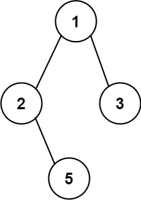

# 257.二叉树的所有路径

给你一个二叉树的根节点 `root` ，按 **任意顺序** ，返回所有从根节点到叶子节点的路径。
**叶子节点** 是指没有子节点的节点。

**示例 1：**



```apach
输入：root = [1,2,3,null,5]
输出：["1->2->5","1->3"]
```

**示例 2：**

```apach
输入：root = [1]
输出：["1"]
```

**提示：**

- 树中节点的数目在范围 `[1, 100]` 内
- `-100 <= Node.val <= 100`

**解法一：** dfs

```python
# Definition for a binary tree node.
# class TreeNode:
#     def __init__(self, val=0, left=None, right=None):
#         self.val = val
#         self.left = left
#         self.right = right
class Solution:
    def binaryTreePaths(self, root: Optional[TreeNode]) -> List[str]:

        paths = []

        def dfs(root, path):
            if not root:
                return
            path += str(root.val)
            if not root.left and not root.right:
                paths.append(path)
            else:
                path += '->'
                dfs(root.left, path)
                dfs(root.right, path)
        
        dfs(root, '')
        return paths
```

一道简单题，写一个`dfs`递归遍历二叉树，当遍历到叶子节点时，将路径添加到结果列表中。
