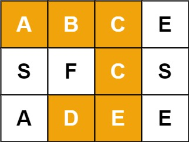
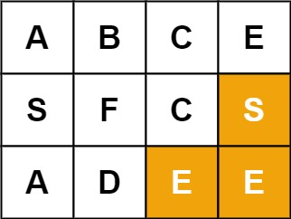
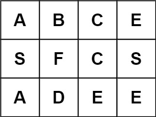

# 79.单词搜索

给定一个 `m x n` 二维字符网格 `board` 和一个字符串单词 `word` 。如果 `word` 存在于网格中，返回 `true` ；否则，返回 `false` 。

单词必须按照字母顺序，通过相邻的单元格内的字母构成，其中“相邻”单元格是那些水平相邻或垂直相邻的单元格。同一个单元格内的字母不允许被重复使用。

**示例 1：**



```apache
输入：board = [["A","B","C","E"],["S","F","C","S"],["A","D","E","E"]], word = "ABCCED"
输出：true
```

**示例 2：**



```apache
输入：board = [["A","B","C","E"],["S","F","C","S"],["A","D","E","E"]], word = "SEE"
输出：true
```

**示例 3：**



```apache
输入：board = [["A","B","C","E"],["S","F","C","S"],["A","D","E","E"]], word = "ABCB"
输出：false
 ```

**提示：**

- `m == board.length`
- `n = board[i].length`
- `1 <= m, n <= 6`
- `1 <= word.length <= 15`
- `board 和 word 仅由大小写英文字母组成`

**进阶：** 你可以使用搜索剪枝的技术来优化解决方案，使其在 `board` 更大的情况下可以更快解决问题？

**解法一：** 回溯法

```python
class Solution:
    def exist(self, board: List[List[str]], word: str) -> bool:
        m, n = len(board), len(board[0])
        length = len(word)
        direction = [[0, 1], [0, -1], [1, 0], [-1, 0]]

        def check(i, j, index):
            if board[i][j] != word[index]:
                return False
            if index == length - 1:
                return True

            visit.add((i, j))
            result = False
            for di, dj in direction:
                new_i, new_j = i + di, j + dj
                if 0 <= new_i < m and 0 <= new_j < n:
                    if (new_i, new_j) not in visit:
                        if check(new_i, new_j, index+1):
                            result = True
                            break
            
            visit.remove((i, j))
            return result

        visit = set()
        for i in range(m):
            for j in range(n):
                if check(i, j, 0):
                    return True
        return False
```

一个简单粗暴的思路，遍历整个二维数组，以每个元素为起点，进行检验，判断是否能够检索到目标单词`word`，如果可以，则返回`True`，若遍历完整个二维数组，都没有找到，则返回`False`。对于判别函数`check`，需要实现的功能是，如果当前检索到的字符与目标单词对应的字符不同，则返回`False`；如果当前检索到的字符与目标单词对应的字符相同，并且当前检索到的字符是目标单词的最后一个字符，则返回`True`；否则，继续检索下一个字符，使用visit集合来记录已经访问过的字符，防止重复访问。列表`direction`里是四个搜索方向，从当前位置分别向四个方向进行检索，成功则返回`True`，失败则继续检索下一个方向，直到遍历完所有方向，如果都没有找到，则返回`False`。最后，将访问过的字符从visit集合中移除，继续搜索下一个起点。

（一件非常愚蠢的时，本来习惯性的在`visit`里面存入列表形式的`[i, j]`，看到报错才想起来，集合里面不能存可变数据类型）

就这样吧，懒得优化了。