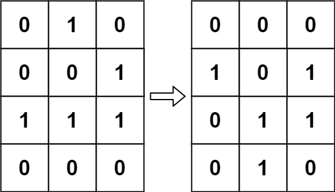
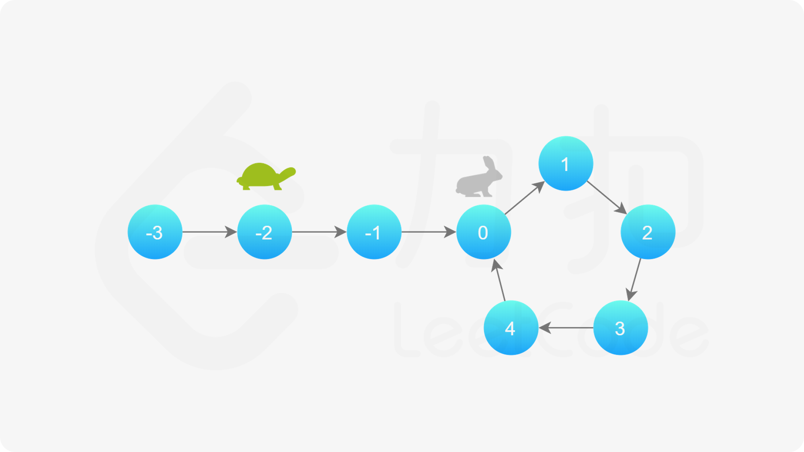

[TOC]

# 169.多数元素

给定一个大小为 `n` 的数组 `nums` ，返回其中的多数元素。多数元素是指在数组中出现次数 **大于** `⌊ n/2 ⌋` 的元素。

你可以假设数组是非空的，并且给定的数组总是存在多数元素。

 

**示例 1：**

```
输入：nums = [3,2,3]
输出：3
```

**示例 2：**

```
输入：nums = [2,2,1,1,1,2,2]
输出：2
```

 

**提示：**

- `n == nums.length`
- `1 <= n <= 5 * 104`
- `-109 <= nums[i] <= 109`

 

**进阶：**尝试设计时间复杂度为 O(n)、空间复杂度为 O(1) 的算法解决此问题。

**解法1**：哈希表

可以用哈希表快速统计每个元素出现的次数

```py
import collections

class Solution:
    def majorityElement(self, nums: List[int]) -> int:
        counts = collections.Counter(nums)
        return max(counts.keys(), key=counts.get)
```

> [`Counter`](https://docs.python.org/zh-cn/3/library/collections.html#collections.Counter) 是 [`dict`](https://docs.python.org/zh-cn/3/library/stdtypes.html#dict) 的子类，用于计数 [hashable](https://docs.python.org/zh-cn/3/glossary.html#term-hashable) 对象。它是一个多项集，元素存储为字典的键而它们的计数存储为字典的值。计数可以是任何整数，包括零或负的计数值。[`Counter`](https://docs.python.org/zh-cn/3/library/collections.html#collections.Counter) 类与其他语言中的 bag 或 multiset 很相似。
>
> 它可以通过计数一个 *iterable* 中的元素来初始化，或用其它 *mapping* (包括 counter) 初始化：

时间复杂度O(n) 空间复杂度O(n)

---

# 121.买卖股票的最佳时机

给定一个数组 `prices` ，它的第 `i` 个元素 `prices[i]` 表示一支给定股票第 `i` 天的价格。

你只能选择 **某一天** 买入这只股票，并选择在 **未来的某一个不同的日子** 卖出该股票。设计一个算法来计算你所能获取的最大利润。

返回你可以从这笔交易中获取的最大利润。如果你不能获取任何利润，返回 `0` 。

 

**示例 1：**

```
输入：[7,1,5,3,6,4]
输出：5
解释：在第 2 天（股票价格 = 1）的时候买入，在第 5 天（股票价格 = 6）的时候卖出，最大利润 = 6-1 = 5 。
     注意利润不能是 7-1 = 6, 因为卖出价格需要大于买入价格；同时，你不能在买入前卖出股票。
```

**示例 2：**

```
输入：prices = [7,6,4,3,1]
输出：0
解释：在这种情况下, 没有交易完成, 所以最大利润为 0。
```

**提示：**

- `1 <= prices.length <= 105`
- `0 <= prices[i] <= 104`

```py
class Solution:
    def maxProfit(self, prices: List[int]) -> int:
        minprice = 100000
        maxprofit = 0
        for i in range(len(prices)):
            profit = prices[i] - minprice
            if minprice > prices[i]:
                minprice = prices[i]
            if profit > maxprofit:
                maxprofit = profit
        return maxprofit    

```

**动态规划：**

假设现在第i天，前i天的最低价格与前i-1天的最低价格有关 `minprice[i] = min(minprice[i-1], price[i])` ，第i天出售股票的最高收益与前i-1天的最第价格有关 `maxprofit = max(maxprofit, price[i] - minprice[i-1])` 

时间复杂度O(n)，空间复杂度O(1)

---

# 55.跳跃游戏

给你一个非负整数数组 `nums` ，你最初位于数组的 **第一个下标** 。数组中的每个元素代表你在该位置可以跳跃的最大长度。

判断你是否能够到达最后一个下标，如果可以，返回 `true` ；否则，返回 `false` 。

 

**示例 1：**

```
输入：nums = [2,3,1,1,4]
输出：true
解释：可以先跳 1 步，从下标 0 到达下标 1, 然后再从下标 1 跳 3 步到达最后一个下标。
```

**示例 2：**

```
输入：nums = [3,2,1,0,4]
输出：false
解释：无论怎样，总会到达下标为 3 的位置。但该下标的最大跳跃长度是 0 ， 所以永远不可能到达最后一个下标。
```

 

**提示：**

- `1 <= nums.length <= 104`
- `0 <= nums[i] <= 105`

**贪心算法**，遍历数组`nums`，维护当前可到达的最远距离 `maxlen = max(maxlen, i+nums[i])`

```py
class Solution:
    def canJump(self, nums: List[int]) -> bool:
        maxlen = 0
        for i in range(len(nums)):
            if i > maxlen:
                break
            if(maxlen < i+nums[i]):
                maxlen = i+nums[i]
        if maxlen >= len(nums)-1:
            return True
        else:
            return False
```

变体：给定一个长度为 `n` 的 **0 索引**整数数组 `nums`。初始位置为 `nums[0]`。

每个元素 `nums[i]` 表示从索引 `i` 向前跳转的最大长度。换句话说，如果你在 `nums[i]` 处，你可以跳转到任意 `nums[i + j]` 处:

- `0 <= j <= nums[i]` 
- `i + j < n`

返回到达 `nums[n - 1]` 的最小跳跃次数。生成的测试用例可以到达 `nums[n - 1]`。

贪心算法：维护当前能够到达的最大下标，称为边界

```py
class Solution:
    def jump(self, nums: List[int]) -> int:
        jump, mlen, end=0, 0, 0
        for i in range(len(nums)-1):
            
            if mlen >= i:
                mlen = max(mlen, i+nums[i])
                if i == end:
                    jump+=1
                    end = mlen
        return jump
```

---

# 380.O(1)时间插入，删除，获取随机元素

实现`RandomizedSet` 类：

- `RandomizedSet()` 初始化 `RandomizedSet` 对象
- `bool insert(int val)` 当元素 `val` 不存在时，向集合中插入该项，并返回 `true` ；否则，返回 `false` 。
- `bool remove(int val)` 当元素 `val` 存在时，从集合中移除该项，并返回 `true` ；否则，返回 `false` 。
- `int getRandom()` 随机返回现有集合中的一项（测试用例保证调用此方法时集合中至少存在一个元素）。每个元素应该有 **相同的概率** 被返回。

你必须实现类的所有函数，并满足每个函数的 **平均** 时间复杂度为 `O(1)` 。

 	**示例：**

```
输入
["RandomizedSet", "insert", "remove", "insert", "getRandom", "remove", "insert", "getRandom"]
[[], [1], [2], [2], [], [1], [2], []]
输出
[null, true, false, true, 2, true, false, 2]
```


**解法：**

数组可以在O(1)的时间内获取随机元素，但是由于无法在O(1)时间内判断元素是否在数组中，所以不能在O(1)时间内插入和删除元素

哈希表可以在O(1)时间内插入和删除元素，但无法在O(1)时间内获取随机元素

将数组与哈希表结合使用，同时维护一个数组和一个哈希表，即可达到效果：

```py
from random import choice
class RandomizedSet:
    def __init__(self):
        self.nums = []
        self.indices = {}

    def insert(self, val: int) -> bool:
        if val in self.indices: #O(1)时间内查找--哈希表
            return False
        self.indices[val] = len(self.nums)
        self.nums.append(val)
        return True

    def remove(self, val: int) -> bool:
        if val not in self.indices: #O(1)时间内查找--哈希表
            return False
        id = self.indices[val]
        self.nums[id] = self.nums[-1]
        self.indices[self.nums[id]] = id
        self.nums.pop()
        del self.indices[val]
        return True

    def getRandom(self) -> int:
        return choice(self.nums) #O(1)时间内获取--数组
```

---

# 238.除自身以外数组的乘积

给你一个整数数组 `nums`，返回 数组 `answer` ，其中 `answer[i]` 等于 `nums` 中除 `nums[i]` 之外其余各元素的乘积 。

题目数据 **保证** 数组 `nums`之中任意元素的全部前缀元素和后缀的乘积都在 **32 位** 整数范围内。

请 **不要使用除法，**且在 `O(n)` 时间复杂度内完成此题。

 

**示例 1:**

```
输入: nums = [1,2,3,4]
输出: [24,12,8,6]
```

**示例 2:**

```
输入: nums = [-1,1,0,-3,3]
输出: [0,0,9,0,0]
```

解法：左右乘积列表

正序和倒序遍历`nums`数组 ，维护两个列表 `Fronlist` 和 `Baclist` 分别保存前i个元素的积和后i个元素的积，然后`answer`的元素直接调用对应的 `Fronlist` 和 `Baclist` 相乘即可

```py
class Solution:
    def productExceptSelf(self, nums: List[int]) -> List[int]:
        Fronlist = []
        mul = 1 
        for i in range(len(nums)):
            mul = mul * nums[i]
            Fronlist.append(mul)

        Baclist = []
        mul = 1
        for i in range(len(nums)):
            mul = mul * nums[len(nums)-i-1]
            Baclist.append(mul)

        answer = []
        for i in range(len(nums)):
            if i==0:
                answer.append(Baclist[len(nums)-2])
                continue
            if i==len(nums)-1:
                answer.append(Fronlist[len(nums)-2])
                continue
            answer.append(Fronlist[i-1]*Baclist[len(nums)-i-2])
        return answer

```

---

# 134.加油站

在一条环路上有 `n` 个加油站，其中第 `i` 个加油站有汽油 `gas[i]` 升。

你有一辆油箱容量无限的的汽车，从第 `i` 个加油站开往第 `i+1` 个加油站需要消耗汽油 `cost[i]` 升。你从其中的一个加油站出发，开始时油箱为空。

给定两个整数数组 `gas` 和 `cost` ，如果你可以按顺序绕环路行驶一周，则返回出发时加油站的编号，否则返回 `-1` 。如果存在解，则 **保证** 它是 **唯一** 的。

 

**示例 1:**

```
输入: gas = [1,2,3,4,5], cost = [3,4,5,1,2]
输出: 3
解释:
从 3 号加油站(索引为 3 处)出发，可获得 4 升汽油。此时油箱有 = 0 + 4 = 4 升汽油
开往 4 号加油站，此时油箱有 4 - 1 + 5 = 8 升汽油
开往 0 号加油站，此时油箱有 8 - 2 + 1 = 7 升汽油
开往 1 号加油站，此时油箱有 7 - 3 + 2 = 6 升汽油
开往 2 号加油站，此时油箱有 6 - 4 + 3 = 5 升汽油
开往 3 号加油站，你需要消耗 5 升汽油，正好足够你返回到 3 号加油站。
因此，3 可为起始索引。
```

解法：贪心算法

首先检查第 0 个加油站，并试图判断能否环绕一周；如果不能，就从第一个无法到达的加油站开始继续检查。

原理：如果x不能到达y，那么x到y之间的所有加油站都不能到达y

```py
class Solution:
    def canCompleteCircuit(self, gas: List[int], cost: List[int]) -> int:
        lenth = len(gas)
        lis = [0]*lenth
        for i in range(lenth):
            lis[i] = gas[i] - cost[i]

        i = 0
        while(i<lenth):
            if lis[i] >= 0:
                p = 0
                j = 0
                while(j<lenth and p >= 0): #从第i个加油站开始跑
                    p+=lis[(i+j)%lenth]
                    if p<0: #跑不动了
                        break
                    j+=1
                if j == lenth: #跑到头了
                    return i
                else: #没跑到头
                    i=i+j #接下来要从第一个没跑到的加油站开始跑
                    continue
            else:
                i+=1
            
        return -1
```

---

# 135.分发糖果

`n` 个孩子站成一排。给你一个整数数组 `ratings` 表示每个孩子的评分。

你需要按照以下要求，给这些孩子分发糖果：

- 每个孩子至少分配到 `1` 个糖果。
- 相邻两个孩子评分更高的孩子会获得更多的糖果。

请你给每个孩子分发糖果，计算并返回需要准备的 **最少糖果数目** 。

 

**示例 1：**

```
输入：ratings = [1,0,2]
输出：5
解释：你可以分别给第一个、第二个、第三个孩子分发 2、1、2 颗糖果。
```

解法：左右遍历

- 左规则：如果 `rating[i-1]<rating[i]` 那么 `left[i]=left[i-1]+1` 否则 `left[i]=1`
- 右规则：如果 `rating[i+1]<rating[i]` 那么 `right[i]=right[i+1]+1` 否则 `right[i]=1`

最终分发糖果的结果序列：`lis[i] = max(left[i],right[i])`

```py
class Solution:
    def candy(self, ratings: List[int]) -> int:
        
        n = len(ratings)
        if n == 1: #特殊情况
            return 1
        left = [0]*n
        right = [0]*n
        for i in range(n): #左规则
            if i>0 and ratings[i-1]<ratings[i]:
                left[i] = left[i-1] + 1
            else:
                left[i] = 1
        for i in reversed(range(n)): #右规则
            if i < n-1 and ratings[i+1]<ratings[i]:
                right[i] = right[i+1] + 1
            else:
                right[i] = 1
        lis = [0]*n
        for i in range(n):
            lis[i] = max(left[i],right[i])
        return sum(lis)
```

---

# 42.接雨水

给定 `n` 个非负整数表示每个宽度为 `1` 的柱子的高度图，计算按此排列的柱子，下雨之后能接多少雨水。

 

**示例 1：**


```
输入：height = [0,1,0,2,1,0,1,3,2,1,2,1]
输出：6
解释：上面是由数组 [0,1,0,2,1,0,1,3,2,1,2,1] 表示的高度图，在这种情况下，可以接 6 个单位的雨水（蓝色部分表示雨水）。 
```

解法1：暴力

从下到上检查二维表每一个点，只要两边有墙，下面有墙或者水，则满足条件

结果：内存溢出

```py
class Solution:
    
    def trap(self, height: List[int]) -> int:
        water = 0
        block = []
        maxhight = max(height)
        n = len(height)
        for i in range(n):
            lis = [1]*height[i]
            while(len(lis)<maxhight):
                lis.append(0)
            block.append(lis)
        for j in range(maxhight):
            for i in range(n):
                if block[i][j] == 0:
                    if j == 0:
                        flag1, flag2 = False, False
                        for i1 in range(i):
                            if block[i1][j] == 1:
                                flag1 = True
                        for i2 in range(i+1, n):
                            if block[i2][j] == 1:
                                flag2 = True
                        if flag1 and flag2:
                            print(f"({i}, {j})")
                            block[i][j] = 2
                            water += 1
                        else:
                            block[i][j] = -1
                    else:
                        if block[i][j-1] == -1:
                            block[i][j] = -1
                            continue
                        elif block[i][j-1] == 1 or block[i][j-1] == 2:
                            flag1, flag2 = False, False
                            for i1 in range(i):
                                if block[i1][j] == 1:
                                    flag1 = True
                            for i2 in range(i+1, n):
                                if block[i2][j] == 1:
                                    flag2 = True
                            if flag1 and flag2:
                                print(f"({i}, {j})")
                                block[i][j] = 2
                                water += 1
                            else:
                                block[i][j] = -1
                                continue
        return water  
```

解法2：

还是暴力（笑

先找到一个“最高峰”，再寻找一个“次高峰”，“次高峰”和“最高峰”之间不高于”次高峰“的空气格子都能装雨水，计算完后再换一个“次高峰”，重复以上步骤，直到没有“次高峰”。

```py
class Solution:
    
    def trap(self, height: List[int]) -> int:
        if len(set(height)) == 1:
            return 0
        if all(height[i] <= height[i + 1] for i in range(len(height) - 1)) or \
        all(height[i] >= height[i + 1] for i in range(len(height) - 1)):
            return 0    #单调的数组直接返回0
        block = []
        n = len(height)
        lised = [-1]*n
        for i in range(n):
            block.append({"index":i, "height":height[i]})
        block.sort( key = lambda x : x["height"])
        highest = block.pop() #弹出最高峰
        index_highest = highest["index"]
        
        while len(block) > 0:
            current_height = block.pop()   #弹出次高峰直到空栈
            index_cur = current_height["index"]
            if lised[index_cur] >= 0:
                continue
            height_cur = current_height["height"]
            if index_cur > index_highest:
                for i in range(index_highest+1, index_cur, 1):
                    if lised[i] < 0:
                        lised[i] = height_cur - height[i]
                        if lised[i] < 0:
                            lised[i] = 0
                        lised[index_cur] = 0
            else:
                for i in range(index_highest-1, index_cur, -1):
                    if lised[i] < 0:
                        lised[i] = height_cur - height[i]
                        if lised[i] < 0:
                            lised[i] = 0
                        lised[index_cur] = 0
        lised[index_highest] = 0
        lised[0]=0
        lised[n-1] = 0
        assert(-1 not in lised)
        return sum(lised)   
```

解法3：动态规划（官解

创建两个长度为 n 的数组 $leftMax 和 rightMax$。对于 $0≤i<n，leftMax[i]$ 表示下标 i 及其左边的位置中，$height$ 的最大高度，r$ightMax[i]$ 表示下标 i 及其右边的位置中，height 的最大高度。

显然，$leftMax[0]=height[0]$，$rightMax[n−1]=height[n−1]$。两个数组的其余元素的计算如下：

当 $1≤i≤n−1$ 时，$leftMax[i]=max(leftMax[i−1],height[i])；$

当 $0≤i≤n−2$ 时，$rightMax[i]=max(rightMax[i+1],height[i])。$

因此可以正向遍历数组 height 得到数组 leftMax 的每个元素值，反向遍历数组 height 得到数组 rightMax 的每个元素值。

在得到数组 leftMax 和 rightMax 的每个元素值之后，对于 0≤i<n，下标 i 处能接的雨水量等于 $min(leftMax[i],rightMax[i])−height[i]$。遍历每个下标位置即可得到能接的雨水总量。

动态规划做法可以由下图体现。


```py
class Solution:
    def trap(self, height: List[int]) -> int:
        if not height:
            return 0
        
        n = len(height)
        leftMax = [height[0]] + [0] * (n - 1)
        for i in range(1, n):
            leftMax[i] = max(leftMax[i - 1], height[i])

        rightMax = [0] * (n - 1) + [height[n - 1]]
        for i in range(n - 2, -1, -1):
            rightMax[i] = max(rightMax[i + 1], height[i])

        ans = sum(min(leftMax[i], rightMax[i]) - height[i] for i in range(n))
        return ans
```

解法4：单调栈

除了计算并存储每个位置两边的最大高度以外，也可以用单调栈计算能接的雨水总量。

维护一个单调栈，单调栈存储的是下标，满足从栈底到栈顶的下标对应的数组 height 中的元素递减。

从左到右遍历数组，遍历到下标 i 时，如果栈内至少有两个元素，记栈顶元素为 top，top 的下面一个元素是 left，则一定有 $height[left]≥height[top]$。如果 $height[i]>height[top]$，则得到一个可以接雨水的区域，该区域的宽度是 i−left−1，高度是 $min(height[left],height[i])−height[top]，$根据宽度和高度即可计算得到该区域能接的雨水量。

为了得到 left，需要将 top 出栈。在对 top 计算能接的雨水量之后，left 变成新的 top，重复上述操作，直到栈变为空，或者栈顶下标对应的 height 中的元素大于或等于 $height[i]。$

在对下标 i 处计算能接的雨水量之后，将 i 入栈，继续遍历后面的下标，计算能接的雨水量。遍历结束之后即可得到能接的雨水总量。

```py
class Solution:
    def trap(self, height: List[int]) -> int:
        ans = 0
        stack = list()
        n = len(height)
        
        for i, h in enumerate(height):
            while stack and h > height[stack[-1]]:
                top = stack.pop()
                if not stack:
                    break
                left = stack[-1]
                currWidth = i - left - 1
                currHeight = min(height[left], height[i]) - height[top]
                ans += currWidth * currHeight
            stack.append(i)
        
        return ans
```

> `enumerate(iterable, start=0)` 
>
> 返回一个枚举对象。*iterable* 必须是一个序列，或 [iterator](https://docs.python.org/zh-cn/3/glossary.html#term-iterator)，或其他支持迭代的对象。 [`enumerate()`](https://docs.python.org/zh-cn/3/library/functions.html#enumerate) 返回的迭代器的 [`__next__()`](https://docs.python.org/zh-cn/3/library/stdtypes.html#iterator.__next__) 方法返回一个元组，里面包含一个计数值（从 *start* 开始，默认为 0）和通过迭代 *iterable* 获得的值。
>
> \>>>
>
> ```py
> >>> seasons = ['Spring', 'Summer', 'Fall', 'Winter']
> >>> list(enumerate(seasons))
> [(0, 'Spring'), (1, 'Summer'), (2, 'Fall'), (3, 'Winter')]
> >>> list(enumerate(seasons, start=1))
> [(1, 'Spring'), (2, 'Summer'), (3, 'Fall'), (4, 'Winter')]
> ```
>
> 等价于:
>
> ```py
> def enumerate(iterable, start=0):
>     n = start
>     for elem in iterable:
>         yield n, elem
>         n += 1
> ```

---

# 13.罗马数字转整数

七个不同的符号代表罗马数字，其值如下：

| 符号 | 值   |
| ---- | ---- |
| I    | 1    |
| V    | 5    |
| X    | 10   |
| L    | 50   |
| C    | 100  |
| D    | 500  |
| M    | 1000 |

罗马数字是通过添加从最高到最低的小数位值的转换而形成的。将小数位值转换为罗马数字有以下规则：

- 如果该值不是以 4 或 9 开头，请选择可以从输入中减去的最大值的符号，将该符号附加到结果，减去其值，然后将其余部分转换为罗马数字。
- 如果该值以 4 或 9 开头，使用 **减法形式**，表示从以下符号中减去一个符号，例如 4 是 5 (`V`) 减 1 (`I`): `IV` ，9 是 10 (`X`) 减 1 (`I`)：`IX`。仅使用以下减法形式：4 (`IV`)，9 (`IX`)，40 (`XL`)，90 (`XC`)，400 (`CD`) 和 900 (`CM`)。
- 只有 10 的次方（`I`, `X`, `C`, `M`）最多可以连续附加 3 次以代表 10 的倍数。你不能多次附加 5 (`V`)，50 (`L`) 或 500 (`D`)。如果需要将符号附加4次，请使用 **减法形式**。

给定一个整数，将其转换为罗马数字。

解法：双指针

```py
class Solution:
    def f(self, s:str) -> int:
        assert(len(s)==1 or len(s)==2)
        if s=='I':
            return 1
        elif s=='V':
            return 5
        elif s=='X':
            return 10
        elif s=='L':
            return 50
        elif s=='C':
            return 100
        elif s=='D':
            return 500
        elif s=='M':
            return 1000
        elif s=='IV':
            return 4
        elif s=='IX':
            return 9
        elif s=='XL':
            return 40
        elif s=="XC":
            return 90
        elif s=='CD':
            return 400
        elif s=='CM':
            return 900
        return 0
    def romanToInt(self, s: str) -> int:
        n = len(s)
        if n == 1:
            return self.f(s)
        i = 0
        j = 1
        num = 0
        while(i<n and j < n):
            if self.f(s[i:j+1]) == 0:
                num += self.f(s[i:j])
                i+=1
                j+=1
            else:
                num += self.f(s[i:j+1])
                i+=2
                j+=2
        if i < n:
            num += self.f(s[i:j])
        return num
```

---

# 12.整数转罗马数字

同上

解法：递归秒了

```py
class Solution:
    def intToRoman(self, num: int) -> str:
        if num == 0:
            return ""
        elif num == 1:
            return "I"
        elif num > 1 and num < 4:
            return "I" + self.intToRoman(num - 1)
        elif num == 4:
            return "IV"
        elif num == 5:
            return "V"
        elif num > 5 and num < 9:
            return "V" + self.intToRoman(num - 5)
        elif num == 9:
            return "IX"
        elif num == 10:
            return "X"
        elif num > 10 and num < 40:
            return "X"+self.intToRoman(num - 10)
        elif num == 40:
            return "XL"
        elif num > 40 and num < 50:
            return "XL"+self.intToRoman(num - 40)
        elif num == 50:
            return "L"
        elif num > 50 and num < 90:
            return "L" + self.intToRoman(num - 50)
        elif num == 90:
            return "XC"
        elif num > 90 and num < 100:
            return "XC" + self.intToRoman(num - 90)
        elif num == 100:
            return "C"
        elif num > 100 and num < 400:
            return "C"+ self.intToRoman(num - 100)
        elif num == 400:
            return "CD"
        elif num > 400 and num < 500:
            return "CD" + self.intToRoman(num-400)
        elif num == 500:
            return "D"
        elif num > 500 and num < 900:
            return "D" + self.intToRoman(num - 500)
        elif num == 900:
            return "CM"
        elif num > 900 and num < 1000:
            return "CM" + self.intToRoman(num - 900)
        elif num == 1000:
            return "M"
        elif num > 1000:
            return "M" + self.intToRoman(num - 1000)
```

~~python写代码真是太快了~~

---

# 14.最长公共前缀

编写一个函数来查找字符串数组中的最长公共前缀。

如果不存在公共前缀，返回空字符串 `""`。

 

**示例 1：**

```
输入：strs = ["flower","flow","flight"]
输出："fl"
```

解法：先排序，再纵向便利数组，更新最长公共前缀，若最长公共前缀更新为0，则`break`

```python
class Solution:
    def longestCommonPrefix(self, strs: List[str]) -> str:
        if len(strs) == 1:
            return strs[0]
        strs.sort(key=lambda x:len(x))
        prefix = strs[0]
        i = 1
        while i < len(strs):
            for j in range(len(prefix), 0, -1):
                if prefix == strs[i][:j]:
                    break
                else:
                    prefix = prefix[0:len(prefix)-1]
                if prefix == "":
                    return ""
            i+=1
        return prefix    
```

---

# 68.文本左右对齐

给定一个单词数组 `words` 和一个长度 `maxWidth` ，重新排版单词，使其成为每行恰好有 `maxWidth` 个字符，且左右两端对齐的文本。

你应该使用 “**贪心算法**” 来放置给定的单词；也就是说，尽可能多地往每行中放置单词。必要时可用空格 `' '` 填充，使得每行恰好有 *maxWidth* 个字符。

要求尽可能均匀分配单词间的空格数量。如果某一行单词间的空格不能均匀分配，则左侧放置的空格数要多于右侧的空格数。

文本的最后一行应为左对齐，且单词之间不插入**额外的**空格。

**注意:**

- 单词是指由非空格字符组成的字符序列。
- 每个单词的长度大于 0，小于等于 *maxWidth*。
- 输入单词数组 `words` 至少包含一个单词。

 

**示例 1:**

```
输入: words = ["This", "is", "an", "example", "of", "text", "justification."], maxWidth = 16
输出:
[
   "This    is    an",
   "example  of text",
   "justification.  "
]
```

模拟这个过程

```python
class Solution:
    def fullJustify(self, words: List[str], maxWidth: int) -> List[str]:
        result = [""]
        while len(words) > 0:
            if len(result[-1]) == 0:
                result[-1] += words.pop(0)
                continue        
            elif len(result[-1]) + len(words[0]) + 1 > maxWidth:
                if " " in result[-1]:
                    spacenum = maxWidth - len(result[-1])
                    j = 0
                    while(spacenum > 0):
                        j = j%len(result[-1])
                        if result[-1][j] == " ":
                            result[-1] = result[-1][:j] + " " + result[-1][j:]
                            while result[-1][j] == " ":
                                j += 1
                                j = j%len(result[-1])
                            spacenum -= 1
                            continue
                        else:
                            j += 1
                else:
                    spacenum = maxWidth - len(result[-1])
                    result[-1] += " "*spacenum
                result.append("")
                continue
            else:
                result[-1] += " " + words.pop(0)
                continue
        spacenum = maxWidth - len(result[-1])
        result[-1] += " "*spacenum    
        return result
```

---

# 392.判断字序列

给定字符串 **s** 和 **t** ，判断 **s** 是否为 **t** 的子序列。

字符串的一个子序列是原始字符串删除一些（也可以不删除）字符而不改变剩余字符相对位置形成的新字符串。（例如，`"ace"`是`"abcde"`的一个子序列，而`"aec"`不是）。

**进阶：**

如果有大量输入的 S，称作 S1, S2, ... , Sk 其中 k >= 10亿，你需要依次检查它们是否为 T 的子序列。在这种情况下，你会怎样改变代码？


zz解法：双指针遍历即可，贪心的匹配`t`靠前的字符

```python
class Solution:
    def isSubsequence(self, s: str, t: str) -> bool:
        i = 0
        j = 0
        while(i<len(s) and j < len(t)):
            if s[i] == t[j]:
                i += 1
                j += 1
                continue
            j += 1
        if i == len(s):
            return True
        return False
```

---

# 11.盛最多水的容器

给定一个长度为 `n` 的整数数组 `height` 。有 `n` 条垂线，第 `i` 条线的两个端点是 `(i, 0)` 和 `(i, height[i])` 。

找出其中的两条线，使得它们与 `x` 轴共同构成的容器可以容纳最多的水。

返回容器可以储存的最大水量。

**说明：**你不能倾斜容器。

 

**示例 1：**


```
输入：[1,8,6,2,5,4,8,3,7]
输出：49 
解释：图中垂直线代表输入数组 [1,8,6,2,5,4,8,3,7]。在此情况下，容器能够容纳水（表示为蓝色部分）的最大值为 49。
```

zz解法1：暴力

将可能出现的下标组合列举出来，再以盛水量（` min(height[x[0]], height[x[1]])*(x[1]-x[0])`）进行关键词排序

```py
class Solution:
    def maxArea(self, height: List[int]) -> int:
        indexlis = [[i,j] for i in range(len(height)-1) for j in range(i+1,len(height))]
        indexlis.sort(reverse=True,key=lambda x: min(height[x[0]], height[x[1]])*(x[1]-x[0]))
        return min(height[indexlis[0][0]], height[indexlis[0][1]])*(indexlis[0][1] - indexlis[0][0])
```

结果：**Memory Limit Exceeded** :joy:

zz解法2：暴力

```py
class Solution:
    def maxArea(self, height: List[int]) -> int:
        maxarea = 0
        for i in range(len(height)-1):
            for j in range(i+1, len(height)):
                maxarea = max(min(height[i], height[j])*(j-i), maxarea)
        return maxarea
```

结果：**Time Limit Exceeded** :joy:

官解：双指针

 初始双指针指向数组两端，每次计算当前双指针指向的容器边界所对应的面积后，**移动数值较小的双指针**（向数组中间移动），此过程中计算出的最大面积即为所求。

证明：本质是一种贪心算法

由于容器的大小由宽度和较小的容器边界决定，考虑初始状态（双指针在数组两端），此时如果移动较大数值的指针的话（无论移动多少），那么容器的容量**不可能**再增加了。如果移动较小数值指针的话，那么容器的容量则**有可能**增加。那么我们只需要每次选择有可能增加容器容量的移动方式，即，移动较小数值的指针，在移动的过程中一定能找到最大的容量。

~~贪心算法的证明一直以来都是鼠鼠的心病~~ 

> 严谨的证明见官网：[11. 盛最多水的容器 - 力扣（LeetCode）](https://leetcode.cn/problems/container-with-most-water/solutions/207215/sheng-zui-duo-shui-de-rong-qi-by-leetcode-solution/?source=vscode)

```py
class Solution:
    def maxArea(self, height: List[int]) -> int:
        maxarea = 0
        i = 0
        j = len(height) - 1
        while(i < j):
            maxarea = max(min(height[i], height[j])*(j-i), maxarea)
            if height[i] > height[j]:
                j -= 1
            else:
                i += 1
        return maxarea
```

---

# 15.三数之和

给你一个整数数组 `nums` ，判断是否存在三元组 `[nums[i], nums[j], nums[k]]` 满足 `i != j`、`i != k` 且 `j != k` ，同时还满足 `nums[i] + nums[j] + nums[k] == 0` 。请你返回所有和为 `0` 且不重复的三元组。

**注意：**答案中不可以包含重复的三元组。

 

**示例 1：**

```
输入：nums = [-1,0,1,2,-1,-4]
输出：[[-1,-1,2],[-1,0,1]]
解释：
nums[0] + nums[1] + nums[2] = (-1) + 0 + 1 = 0 。
nums[1] + nums[2] + nums[4] = 0 + 1 + (-1) = 0 。
nums[0] + nums[3] + nums[4] = (-1) + 2 + (-1) = 0 。
不同的三元组是 [-1,0,1] 和 [-1,-1,2] 。
注意，输出的顺序和三元组的顺序并不重要。
```


zz解法：双指针

先对数组nums进行排序。

不失一般性，设 $i<j<k$ ，对 $i(0\le i \le \text{len}(nums)-2)$ 进行遍历，然后对 $j$ 和 $k$ 使用双指针进行遍历，总时间复杂度为 $O(n^2)$

```py
class Solution:
    def threeSum(self, nums: List[int]) -> List[List[int]]:
        nums.sort()
        if nums[0] >= 0:
            if nums[-1] == 0:
                return [[0,0,0]]
            else:
                return []
        result = []
        for i in range(len(nums)-2):
            if i > 0 and nums[i] == nums[i-1]:
                continue
            j = i + 1
            k = len(nums)-1
            while j < k:
                if nums[i] + nums[j] + nums[k] == 0:
                    result.append([nums[i], nums[j], nums[k]])
                    j += 1
                    while j<k and nums[j]==nums[j-1]:
                        j += 1
                    k -= 1
                    while j<k and nums[k] == nums[k+1]:
                        k -= 1
                elif nums[i] + nums[j] + nums[k] > 0:
                    k -= 1
                    while j<k and nums[k] == nums[k+1]:
                        k -= 1
                else:
                    j += 1
                    while j<k and nums[j]==nums[j-1]:
                        j += 1
        return result
```

---

# 209.长度最小的子数组

给定一个含有 `n` 个正整数的数组和一个正整数 `target`.找出该数组中满足其总和大于等于 `target` 的长度最小的 **子数组** `[numsl, numsl+1, ..., numsr-1, numsr]` ，并返回其长度**。**如果不存在符合条件的子数组，返回 `0` 。


```
输入：target = 7, nums = [2,3,1,2,4,3]
输出：2
解释：子数组 [4,3] 是该条件下的长度最小的子数组。
```


- zz解法：滑动窗口

  维护`numsum`变量, 左右窗口`i, j` ,开始遍历. 

  当`numsum >= target` 时,  左窗口右移, 变量 `numsum` 减少窗口移动的值 `numsum -= nums[i]`

  当`numsum < target` 时, 右窗口右移, 变量`numsum` 增加窗口移动的值 `numsum += nums[i]` 

  取此过程中左右窗口的最近距离

```py
class Solution:
    def minSubArrayLen(self, target: int, nums: List[int]) -> int:
        i = j = 0
        if sum(nums) < target:
            return 0
        minlen = len(nums)
        numsum = nums[0]
        while i < len(nums) and j < len(nums):
            if numsum >= target:
                minlen = min(minlen, j-i+1)
                numsum -= nums[i]
                i+=1
                nums
            elif numsum < target:                
                j+=1
                if j < len(nums):
                    numsum += nums[j]
        return minlen
```

---

# 3.无重复字符的最长字串

给定一个字符串 `s` ，请你找出其中不含有重复字符的 **最长 子串** 的长度。

 

**示例 1:**

```
输入: s = "abcabcbb"
输出: 3 
解释: 因为无重复字符的最长子串是 "abc"，所以其长度为 3。
```


- zz解法：滑动窗口

  当右窗口下一个字符不在窗口内时，移动右窗口，反之，移动左窗口

  在此过程中维护一个哈希集合 `strset` ，用于在O(1)时间内判断字符是否在窗口内

  ```py
  class Solution:
      def lengthOfLongestSubstring(self, s: str) -> int:
          if len(s) == 1:
              return 1
          elif len(s) == 0:
              return 0
          i = j = 0
          maxlen = 0
          strset = set()
          strset.add(s[0])
          while i < len(s) and j < len(s):
              if j == len(s) - 1 or s[j+1] in strset:
                  strset.remove(s[i])
                  i += 1
                  maxlen = max(maxlen, j-i+1)
              elif s[j+1] not in strset:
                  j += 1
                  strset.add(s[j])
                  maxlen = max(maxlen, j-i+1)
          return maxlen  
  ```

> *set* 对象是由具有唯一性的 [hashable](https://docs.python.org/zh-cn/3/glossary.html#term-hashable) 对象所组成的无序多项集。 常见的用途包括成员检测、从序列中去除重复项以及数学中的集合类计算，例如交集、并集、差集与对称差集等等。 （关于其他容器对象请参看 [`dict`](https://docs.python.org/zh-cn/3/library/stdtypes.html#dict), [`list`](https://docs.python.org/zh-cn/3/library/stdtypes.html#list) 与 [`tuple`](https://docs.python.org/zh-cn/3/library/stdtypes.html#tuple) 等内置类，以及 [`collections`](https://docs.python.org/zh-cn/3/library/collections.html#module-collections) 模块。）
>
> 与其他多项集一样，集合也支持 `x in set`, `len(set)` 和 `for x in set`。 作为一种无序的多项集，集合并不记录元素位置或插入顺序。 相应地，集合不支持索引、切片或其他序列类的操作。
>
> 目前有两种内置集合类型，[`set`](https://docs.python.org/zh-cn/3/library/stdtypes.html#set) 和 [`frozenset`](https://docs.python.org/zh-cn/3/library/stdtypes.html#frozenset)。 [`set`](https://docs.python.org/zh-cn/3/library/stdtypes.html#set) 类型是可变的 --- 其内容可以使用 `add()` 和 `remove()` 这样的方法来改变。 由于是可变类型，它没有哈希值，且不能被用作字典的键或其他集合的元素。 [`frozenset`](https://docs.python.org/zh-cn/3/library/stdtypes.html#frozenset) 类型是不可变并且为 [hashable](https://docs.python.org/zh-cn/3/glossary.html#term-hashable) --- 其内容在被创建后不能再改变；因此它可以被用作字典的键或其他集合的元素。
>
> 除了可以使用 [`set`](https://docs.python.org/zh-cn/3/library/stdtypes.html#set) 构造器，非空的 set (不是 frozenset) 还可以通过将以逗号分隔的元素列表包含于花括号之内来创建，例如: `{'jack', 'sjoerd'}`。

---

# 30.串联所有单词的字串

给定一个字符串 `s` 和一个字符串数组 `words`**。** `words` 中所有字符串 **长度相同**。

 `s` 中的 **串联子串** 是指一个包含 `words` 中所有字符串以任意顺序排列连接起来的子串。

- 例如，如果 `words = ["ab","cd","ef"]`， 那么 `"abcdef"`， `"abefcd"`，`"cdabef"`， `"cdefab"`，`"efabcd"`， 和 `"efcdab"` 都是串联子串。 `"acdbef"` 不是串联子串，因为他不是任何 `words` 排列的连接。

返回所有串联子串在 `s` 中的开始索引。你可以以 **任意顺序** 返回答案。

 

**示例 1：**

```
输入：s = "barfoothefoobarman", words = ["foo","bar"]
输出：[0,9]
解释：因为 words.length == 2 同时 words[i].length == 3，连接的子字符串的长度必须为 6。
子串 "barfoo" 开始位置是 0。它是 words 中以 ["bar","foo"] 顺序排列的连接。
子串 "foobar" 开始位置是 9。它是 words 中以 ["foo","bar"] 顺序排列的连接。
输出顺序无关紧要。返回 [9,0] 也是可以的。
```


- zz解法：

滑动窗口，但不全是滑动窗口

将`words`中的内容存入哈希表`wordset`，键为单词字符串，值为该单词在`words`中的数量。当右窗口指向的单词在 `wordset`中时，右窗口移动相当于单词长度的距离且单词在`wordset`中对应的词减1；当右窗口不在`wordset`中时， 左窗口移动一位，右窗口和左窗口对齐，重置`wordset`；当左右窗口之间距离达到`wordlen*len(words)`, 说明找到了一个符合条件的下标

设s长度为ls，words长度为lw，则最坏情况下时间复杂度为 $O(ls\times lw)$ 

第21行的 `j = i` 使得一个变态的coner case超时了（真恶心啊

 ```py
 class Solution:
     def findSubstring(self, s: str, words: List[str]) -> List[int]:
         wordlen = len(words[0])
         n = wordlen * len(words)
         ilis = []
         i = j = 0
         wordset = Counter(words)
         while i<len(s) and j + wordlen  <= len(s):
             if s[j:j+wordlen] in wordset and wordset[s[j:j+wordlen]] > 0:
                 wordset[s[j:j+wordlen]] -= 1
                 j += wordlen
             else:
                 i+=1
                 j = i
                 wordset = Counter(words)
             if j < i :
                 j = i 
             if j - i == n:
                 ilis.append(i)
                 i += 1
                 j = i
                 wordset = Counter(words)
         return ilis
 ```

- 官解

思路

此题是「438. 找到字符串中所有字母异位词」的进阶版。不同的是第 438 题的元素是字母，而此题的元素是单词。可以用类似「438. 找到字符串中所有字母异位词的官方题解」的方法二的滑动窗口来解这题。

记 words 的长度为 m，words 中每个单词的长度为 n，s 的长度为 ls。首先需要将 s 划分为单词组，每个单词的大小均为 n （首尾除外）。这样的划分方法有 n 种，即先删去前 i （i=0∼n−1）个字母后，将剩下的字母进行划分，如果末尾有不到 n 个字母也删去。对这 n 种划分得到的单词数组分别使用滑动窗口对 words 进行类似于「字母异位词」的搜寻。

划分成单词组后，一个窗口包含 s 中前 m 个单词，用一个哈希表 differ 表示窗口中单词频次和 words 中单词频次之差。初始化 differ 时，出现在窗口中的单词，每出现一次，相应的值增加 1，出现在 words 中的单词，每出现一次，相应的值减少 1。然后将窗口右移，右侧会加入一个单词，左侧会移出一个单词，并对 differ 做相应的更新。窗口移动时，若出现 differ 中值不为 0 的键的数量为 0，则表示这个窗口中的单词频次和 words 中单词频次相同，窗口的左端点是一个待求的起始位置。划分的方法有 n 种，做 n 次滑动窗口后，即可找到所有的起始位置。

```py
class Solution:
    def findSubstring(self, s: str, words: List[str]) -> List[int]:
        res = []
        m, n, ls = len(words), len(words[0]), len(s)
        for i in range(n):
            if i + m * n > ls:
                break
            differ = Counter()
            for j in range(m):
                word = s[i + j * n: i + (j + 1) * n]
                differ[word] += 1
            for word in words:
                differ[word] -= 1
                if differ[word] == 0:
                    del differ[word]
            for start in range(i, ls - m * n + 1, n):
                if start != i:
                    word = s[start + (m - 1) * n: start + m * n]
                    differ[word] += 1
                    if differ[word] == 0:
                        del differ[word]
                    word = s[start - n: start]
                    differ[word] -= 1
                    if differ[word] == 0:
                        del differ[word]
                if len(differ) == 0:
                    res.append(start)
        return res
```

复杂度分析

时间复杂度：O(ls×n)，其中 ls 是输入 s 的长度，n 是 words 中每个单词的长度。需要做 n 次滑动窗口，每次需要遍历一次 s。

---

# 76.最小覆盖子串


给你一个字符串 `s` 、一个字符串 `t` 。返回 `s` 中涵盖 `t` 所有字符的最小子串。如果 `s` 中不存在涵盖 `t` 所有字符的子串，则返回空字符串 `""` 。

 

**注意：**

- 对于 `t` 中重复字符，我们寻找的子字符串中该字符数量必须不少于 `t` 中该字符数量。
- 如果 `s` 中存在这样的子串，我们保证它是唯一的答案。

 

**示例 1：**

```
输入：s = "ADOBECODEBANC", t = "ABC"
输出："BANC"
解释：最小覆盖子串 "BANC" 包含来自字符串 t 的 'A'、'B' 和 'C'。
```


- zz解法：滑动窗口

维护哈希表 `dictt` ，`dictt` 中为窗口中目标字符和字符串 `t` 的字符数量之差；维护变量 `flag` ，`flag` 为窗口中数量足够的目标字符的数量，表现为`dictt` 中值小于等于0的键的数量。

当 `flag > 0` 时，移动右窗口，如果移入窗口内的字符是目标字符就对 `dictt` 和 `flag` 做处理；当 `flag == 0` 时，移动左窗口，如果移出窗口的字符是目标字符就对`dictt`和`flag`做处理。当 `flag > 0` 且右窗口已经移动到 `s` 的末位，就退出循环。记录循环过程中长度最小的字符串。

```py
class Solution:
    def minWindow(self, s: str, t: str) -> str:
        i = j = 0
        dictt = Counter(t)
        minlen = len(s)
        minlenstr = ""
        flag = len(set(t));
        while i<len(s) and j<len(s)+1:
            if flag > 0 and j == len(s):#j已经无法移动
                break
            if flag > 0 and s[j] in dictt:
                dictt[s[j]] -= 1
                if dictt[s[j]] == 0:#有一个字符满足了数量条件
                    flag -= 1
                j+=1
            elif flag > 0 and s[j] not in dictt:
                j+=1
            if flag == 0 and s[i] in dictt:#只需在左窗口移动时尝试更新minlen和minlenstr即可
                if j - i <= minlen:
                    minlenstr = s[i:j]
                    minlen = j-i
                dictt[s[i]] += 1
                if dictt[s[i]] == 1:
                    flag += 1
                i+=1
            elif flag == 0 and s[i] not in dictt:
                if j - i <= minlen:
                    minlenstr = s[i:j]
                    minlen = j-i
                i+=1
        return minlenstr
```


---

# 36.有效的数独

请你判断一个 `9 x 9` 的数独是否有效。只需要 **根据以下规则** ，验证已经填入的数字是否有效即可。

1. 数字 `1-9` 在每一行只能出现一次。
2. 数字 `1-9` 在每一列只能出现一次。
3. 数字 `1-9` 在每一个以粗实线分隔的 `3x3` 宫内只能出现一次。（请参考示例图）

 

**注意：**

- 一个有效的数独（部分已被填充）不一定是可解的。
- 只需要根据以上规则，验证已经填入的数字是否有效即可。
- 空白格用 `'.'` 表示。

 

**示例 1：**


```
输入：board = 
[["5","3",".",".","7",".",".",".","."]
,["6",".",".","1","9","5",".",".","."]
,[".","9","8",".",".",".",".","6","."]
,["8",".",".",".","6",".",".",".","3"]
,["4",".",".","8",".","3",".",".","1"]
,["7",".",".",".","2",".",".",".","6"]
,[".","6",".",".",".",".","2","8","."]
,[".",".",".","4","1","9",".",".","5"]
,[".",".",".",".","8",".",".","7","9"]]
输出：true
```

- zz解法：哈希表

用哈希表储存遍历到的数字，共需要9+9+1=19张表

```py
class Solution:
    def isValidSudoku(self, board: List[List[str]]) -> bool:
        liss = [set() for _ in range(9)]
        lisd = [set() for _ in range(9)]
        for i in range(9):
            se = set()
            for j in range(9):
                if board[i][j] == '.':
                    continue
                if board[i][j] not in se and board[i][j] not in liss[j]\
                    and board[i][j] not in lisd[3*(i//3)+j//3]:
                    se.add(board[i][j])
                    liss[j].add(board[i][j])
                    lisd[3*(i//3)+j//3].add(board[i][j])
                else:
                    return False
        return True     
```

---

# 54.螺旋矩阵

给你一个 `m` 行 `n` 列的矩阵 `matrix` ，请按照 **顺时针螺旋顺序** ，返回矩阵中的所有元素。

 

**示例 1：**


```
输入：matrix = [[1,2,3],[4,5,6],[7,8,9]]
输出：[1,2,3,6,9,8,7,4,5]
```


- zz解法：哈希集合记录已经遍历到的序列元组，以便用O(1)时间查询某个位置是否被遍历过，如果遍历过程碰壁（遍历到矩阵边缘或遍历到已经遍历过的位置），就顺时针改变遍历方向。

```py
class Solution:
    def spiralOrder(self, matrix: List[List[int]]) -> List[int]:
        index = [0,0]
        lis = [(0,1), (1,0), (0,-1), (-1,0)] #预设的遍历方向
        index_lis = 0 #当前遍历方向
        i = 1
        result = []
        result.append(matrix[0][0]) #将第一个元素加入结果列表
        hashset = set()
        hashset.add((0,0))#将第一个序列元组加入哈希集合
        n = len(matrix) 
        m = len(matrix[0])
        while i < n*m:
            if index[0]+lis[index_lis][0] < n and index[0]+lis[index_lis][0]>=0\
            and index[1]+lis[index_lis][1] < m and index[1]+lis[index_lis][1]>=0\
            and (index[0]+lis[index_lis][0],index[1]+lis[index_lis][1]) not in hashset:
                index[0] = index[0]+lis[index_lis][0]
                index[1] = index[1]+lis[index_lis][1]
                result.append(matrix[index[0]][index[1]])
                hashset.add((index[0], index[1])) 
                print((index[0], index[1]))
                i += 1

            else:
                index_lis = (index_lis+1)%4 #“碰壁了”，顺时针改变遍历方向
        return result

```

---

# 48.旋转图像

给定一个 *n* × *n* 的二维矩阵 `matrix` 表示一个图像。请你将图像顺时针旋转 90 度。

你必须在**[ 原地](https://baike.baidu.com/item/原地算法)** 旋转图像，这意味着你需要直接修改输入的二维矩阵。**请不要** 使用另一个矩阵来旋转图像。

 

**示例 1：**


```
输入：matrix = [[1,2,3],[4,5,6],[7,8,9]]
输出：[[7,4,1],[8,5,2],[9,6,3]]
```

- zz解法：旋转后的矩阵与旋转前的矩阵关系为 `matrix_after[i][j] = matrix_before[n-1-j][i]`

  分奇偶性讨论，一次使四个旋转位置的元素依次交换（利用python特性

```py
class Solution:
    def rotate(self, matrix: List[List[int]]) -> None:
        """
        Do not return anything, modify matrix in-place instead.
        """
        n = len(matrix)
        for i in range(n//2):
            for j in range(n//2):
                matrix[i][j], matrix[j][n-1-i], matrix[n-1-i][n-1-j], matrix[n-1-j][i]\
                = matrix[n-1-j][i], matrix[i][j], matrix[j][n-1-i], matrix[n-1-i][n-1-j]
        if n%2 == 0:
            return
        else:
            for i in range(n//2):
                j = n//2
                matrix[i][j], matrix[j][n-1-i], matrix[n-1-i][n-1-j], matrix[n-1-j][i]\
                = matrix[n-1-j][i], matrix[i][j], matrix[j][n-1-i], matrix[n-1-i][n-1-j]
            return
```

- 官解：[用翻转代替旋转](https://leetcode.cn/problems/rotate-image/solutions/526980/xuan-zhuan-tu-xiang-by-leetcode-solution-vu3m/)

  先水平翻转，再根据主对角线翻转得到结果：

```py
class Solution:
    def rotate(self, matrix: List[List[int]]) -> None:
        n = len(matrix)
        # 水平翻转
        for i in range(n // 2):
            for j in range(n):
                matrix[i][j], matrix[n - i - 1][j] = matrix[n - i - 1][j], matrix[i][j]
        # 主对角线翻转
        for i in range(n):
            for j in range(i):
                matrix[i][j], matrix[j][i] = matrix[j][i], matrix[i][j]
```

---

# 73.矩阵置零

给定一个 `*m* x *n*` 的矩阵，如果一个元素为 **0** ，则将其所在行和列的所有元素都设为 **0** 。请使用 **[原地](http://baike.baidu.com/item/原地算法)** 算法**。**

 

**示例 1：**


```
输入：matrix = [[1,1,1],[1,0,1],[1,1,1]]
输出：[[1,0,1],[0,0,0],[1,0,1]]
```

- zz解法：遍历 使用哈希集合储存需要置零的行和列 遍历结束后再遍历哈希集合 依次置零

```py
class Solution:
    def setZeroes(self, matrix: List[List[int]]) -> None:
        """
        Do not return anything, modify matrix in-place instead.
        """
        hashset1 = set()
        hashset2 = set()
        for i in range(len(matrix)):
            flag = False
            for j in range(len(matrix[0])):
                if matrix[i][j] == 0 :
                    hashset1.add(j)
                    flag = True                    
            if flag:
                hashset2.add(i)
        for j in hashset1:
            for k in range(len(matrix)):
                matrix[k][j] = 0
        for i in hashset2:
            for k in range(len(matrix[0])):
                matrix[i][k] = 0
```

---

# 289.生命游戏

根据 [百度百科](https://baike.baidu.com/item/生命游戏/2926434?fr=aladdin) ， **生命游戏** ，简称为 **生命** ，是英国数学家约翰·何顿·康威在 1970 年发明的细胞自动机。

给定一个包含 `m × n` 个格子的面板，每一个格子都可以看成是一个细胞。每个细胞都具有一个初始状态： `1` 即为 **活细胞** （live），或 `0` 即为 **死细胞** （dead）。每个细胞与其八个相邻位置（水平，垂直，对角线）的细胞都遵循以下四条生存定律：

1. 如果活细胞周围八个位置的活细胞数少于两个，则该位置活细胞死亡；
2. 如果活细胞周围八个位置有两个或三个活细胞，则该位置活细胞仍然存活；
3. 如果活细胞周围八个位置有超过三个活细胞，则该位置活细胞死亡；
4. 如果死细胞周围正好有三个活细胞，则该位置死细胞复活；

下一个状态是通过将上述规则同时应用于当前状态下的每个细胞所形成的，其中细胞的出生和死亡是同时发生的。给你 `m x n` 网格面板 `board` 的当前状态，返回下一个状态。

 

**示例 1：**



```
输入：board = [[0,1,0],[0,0,1],[1,1,1],[0,0,0]]
输出：[[0,0,0],[1,0,1],[0,1,1],[0,1,0]]
```

- zz解法：遍历矩阵，用哈希集合存放需要改变的位置下标，会引发状态改变的规则为第1，3，4条

```py
class Solution:
    def gameOfLife(self, board: List[List[int]]) -> None:
        """
        Do not return anything, modify board in-place instead.
        """
        hashset1 = set()
        n = len(board)
        m = len(board[0])
        lis = [(-1,0), (1,0), (0,1), (0,-1), (1,1), (1,-1), (-1,1), (-1,-1)]
        for i in range(len(board)):
            for j in range(len(board[0])):
                countlive = 0
                for ki, kj in lis:
                    if i+ki >= n or i+ki < 0\
                    or j+kj >= m or j+kj < 0:
                        continue
                    else:
                        if board[i+ki][j+kj] == 1:
                            countlive += 1
                if board[i][j] == 0 and countlive == 3:
                    hashset1.add((i,j))
                elif board[i][j] == 1 and (countlive < 2 or countlive > 3):
                    hashset1.add((i,j))

        for i, j in hashset1:
            board[i][j] = int(not board[i][j])
```

---

# 383.赎金信

给你两个字符串：`ransomNote` 和 `magazine` ，判断 `ransomNote` 能不能由 `magazine` 里面的字符构成。

如果可以，返回 `true` ；否则返回 `false` 。

`magazine` 中的每个字符只能在 `ransomNote` 中使用一次。

 

**示例 1：**

```
输入：ransomNote = "a", magazine = "b"
输出：false
```


- zz解法：哈希表Counter

```py
class Solution:
    def canConstruct(self, ransomNote: str, magazine: str) -> bool:
        hashcounter = Counter(magazine)
        for char in ransomNote:
            if hashcounter[char] == 0:
                return False
            else:
                hashcounter[char] -= 1
                continue
        return True
```

---

# 205.同构字符串

给定两个字符串 `s` 和 `t` ，判断它们是否是同构的。

如果 `s` 中的字符可以按某种映射关系替换得到 `t` ，那么这两个字符串是同构的。

每个出现的字符都应当映射到另一个字符，同时不改变字符的顺序。不同字符不能映射到同一个字符上，相同字符只能映射到同一个字符上，字符可以映射到自己本身。

 

**示例 1:**

```
输入：s = "egg", t = "add"
输出：true
```


- zz解法：哈希表

  两个哈希表分别记录s到t的映射和t到s的映射，遍历字符串s和t，在遍历过程中检查是否符合一一映射

```py
class Solution:
    def isIsomorphic(self, s: str, t: str) -> bool:
        dic = {}
        dic1 = {}
        for i in range(len(s)):
            if s[i] not in dic and t[i] not in dic1:
                dic[s[i]] = t[i]
                dic1[t[i]] = s[i]
            elif s[i] in dic and t[i] in dic1 and \
            dic[s[i]] == t[i] and dic1[t[i]] == s[i]:
                continue
            else:
                return False
        return True 
```

---

# 49.字母异位词分组

给你一个字符串数组，请你将 **字母异位词** 组合在一起。可以按任意顺序返回结果列表。

**字母异位词** 是由重新排列源单词的所有字母得到的一个新单词。

 

**示例 1:**

```py
输入: strs = ["eat", "tea", "tan", "ate", "nat", "bat"]
输出: [["bat"],["nat","tan"],["ate","eat","tea"]]
```

- zz解法：哈希

  初始化一个空字典 `resultdic` ，字典的键储存可以标识异位字符串的哈希对象，字典的值储存结果列表。

  使用 `Counter` 对象，可保证每个异位字符串的 `Counter(string)` 相同。遍历 `str` ，若 `Counter(string)` 不在字典 `resultdic` 中，则将相应的键值对添加进去；否则，修改相应的键值对的值

  > [!NOTE]
  >
  > 注意 `Counter` 对象不是一个 hashable 的对象，要将其转换为 `frozenset` 对象才能作为字典的键。

```py
class Solution:
    def groupAnagrams(self, strs: List[str]) -> List[List[str]]:
        resultdic = {}
        for i, string in enumerate(strs):
            fset = frozenset(Counter(string).items())
            if len(resultdic) == 0 or fset not in resultdic:
                resultdic[fset] = [string]
            else:
                resultdic[fset].append(string)
        return list(resultdic.values())
```

- 官解：计数哈希

  由于互为字母异位词的两个字符串包含的字母相同，因此两个字符串中的相同字母出现的次数一定是相同的，故可以将每个字母出现的次数使用字符串表示，作为哈希表的键。

  由于字符串只包含小写字母，因此对于每个字符串，**可以使用长度为 26 的数组记录每个字母出现的次数**。需要注意的是，在使用数组作为哈希表的键时，不同语言的支持程度不同，因此不同语言的实现方式也不同。

```py
class Solution:
    def groupAnagrams(self, strs: List[str]) -> List[List[str]]:
        mp = collections.defaultdict(list)

        for st in strs:
            counts = [0] * 26
            for ch in st:
                counts[ord(ch) - ord("a")] += 1
            # 需要将 list 转换成 tuple 才能进行哈希
            mp[tuple(counts)].append(st)
        
        return list(mp.values())
```


---

# 128.最长连续序列

给定一个未排序的整数数组 `nums` ，找出数字连续的最长序列（不要求序列元素在原数组中连续）的长度。

请你设计并实现时间复杂度为 `O(n)` 的算法解决此问题。

 

**示例 1：**

```
输入：nums = [100,4,200,1,3,2]
输出：4
解释：最长数字连续序列是 [1, 2, 3, 4]。它的长度为 4。，
```


- zz解法：将数组转化为哈希集合 `numset` ，从集合里pop出一个元素，分别尝试向加1和减1两个方向上寻找连续的元素，如果找到就从集合里删除找到的元素。每找到一个元素就把当前的序列长度加1，找不到了就得到了一个连续序列的长度，维护这个过程中最长的连续序列。

```py
class Solution:
    def longestConsecutive(self, nums: List[int]) -> int:
        numset = set(nums)
        maxlenth = 0
        while len(numset) != 0:
            num = numset.pop()
            lenth = 1
            i = num
            while i+1 in numset:
                numset.remove(i+1)
                lenth += 1
                i += 1
            i = num
            while i-1 in numset:
                numset.remove(i-1)
                lenth += 1
                i -= 1
            maxlenth = max(lenth, maxlenth)
        return maxlenth
```

---

# 56.合并区间

以数组 `intervals` 表示若干个区间的集合，其中单个区间为 `intervals[i] = [starti, endi]` 。请你合并所有重叠的区间，并返回 *一个不重叠的区间数组，该数组需恰好覆盖输入中的所有区间* 。

 

**示例 1：**

```
输入：intervals = [[1,3],[2,6],[8,10],[15,18]]
输出：[[1,6],[8,10],[15,18]]
解释：区间 [1,3] 和 [2,6] 重叠, 将它们合并为 [1,6].
```

> [!NOTE]
>
> 数组 `interval` 不一定是有序的

- zz解法：单调栈

  维护单调栈 `result` ，栈中的区间以递增的顺序排列且没有重叠。

  从 `interval` 中弹出一个区间`lis1`，如果区间左边界大于 `result` 右边界，说明符合单调栈规则，直接入栈。

  否则，从 `result` 不断弹出区间加入到 `interval` 中。直到区间可以入栈时，停止 `result` 弹出，从 `interval` 顶部弹出一个区间`lis2`，如果可以和`lis1`合并，则合并后再加入 `result` 中；否则，将`lis1` 和 `lis2` 依次加入栈中。

  循环上面的步骤直到 `interval` 为空，返回 `result`。

```py
class Solution:
    def merge(self, intervals: List[List[int]]) -> List[List[int]]:
        result = []
        while len(intervals) > 0:
            if len(result) == 0:
                result.append(intervals.pop())
                continue
            lis = intervals.pop()
            if lis[0] > result[-1][1]:
                result.append(lis)
            else:
                while len(result) > 0 and lis[0] <= result[-1][1]:
                    intervals.append(result.pop())
                lis2 = intervals.pop()
                if lis2[0] > lis[1]:
                    result.append(lis)
                    result.append(lis2)
                else:
                    lis[0] = min(lis[0], lis2[0])
                    lis[1] = max(lis[1], lis2[1])
                    result.append(lis)
        return result
```

- 官解：排序

  我们用数组 merged 存储最终的答案。

  首先，我们将列表中的区间按照左端点升序排序。然后我们将第一个区间加入 merged 数组中，并按顺序依次考虑之后的每个区间：

  如果当前区间的左端点在数组 merged 中最后一个区间的右端点之后，那么它们不会重合，我们可以直接将这个区间加入数组 merged 的末尾；

  否则，它们重合，我们需要用当前区间的右端点更新数组 merged 中最后一个区间的右端点，将其置为二者的较大值。

```python
class Solution:
    def merge(self, intervals: List[List[int]]) -> List[List[int]]:
        intervals.sort(key=lambda x: x[0])

        merged = []
        for interval in intervals:
            # 如果列表为空，或者当前区间与上一区间不重合，直接添加
            if not merged or merged[-1][1] < interval[0]:
                merged.append(interval)
            else:
                # 否则的话，我们就可以与上一区间进行合并
                merged[-1][1] = max(merged[-1][1], interval[1])

        return merged
```


---

# 57.插入区间

给你一个 **无重叠的** *，*按照区间起始端点排序的区间列表 `intervals`，其中 `intervals[i] = [starti, endi]` 表示第 `i` 个区间的开始和结束，并且 `intervals` 按照 `starti` 升序排列。同样给定一个区间 `newInterval = [start, end]` 表示另一个区间的开始和结束。

在 `intervals` 中插入区间 `newInterval`，使得 `intervals` 依然按照 `starti` 升序排列，且区间之间不重叠（如果有必要的话，可以合并区间）。

返回插入之后的 `intervals`。

**注意** 你不需要原地修改 `intervals`。你可以创建一个新数组然后返回它。

 

**示例 1：**

```
输入：intervals = [[1,3],[6,9]], newInterval = [2,5]
输出：[[1,5],[6,9]]
```

- zz解法：模拟过程即可

```py
class Solution:
    def insert(self, intervals: List[List[int]], newInterval: List[int]) -> List[List[int]]:
        result = []
        flag = False
        for i, inter in enumerate(intervals):
            if (inter[1] < newInterval[0] and not flag) or\
                (inter[0] > newInterval[1] and flag):
                result.append(inter)
                continue
            elif inter[0] > newInterval[1] and not flag:
                result.append(newInterval)
                result.append(inter)
                flag = True
            elif (newInterval[0] >= inter[0] and newInterval[0] <= inter[1]) or\
            (newInterval[1] >= inter[0] and newInterval[1] <= inter[1]):
                newInterval[0] = min(newInterval[0], inter[0])
                newInterval[1] = max(newInterval[1], inter[1])
        if not flag:
            result.append(newInterval)
        return result       
```

---

# 452.用最少数量的箭引爆气球

有一些球形气球贴在一堵用 XY 平面表示的墙面上。墙面上的气球记录在整数数组 `points` ，其中`points[i] = [xstart, xend]` 表示水平直径在 `xstart` 和 `xend`之间的气球。你不知道气球的确切 y 坐标。

一支弓箭可以沿着 x 轴从不同点 **完全垂直** 地射出。在坐标 `x` 处射出一支箭，若有一个气球的直径的开始和结束坐标为 `x``start`，`x``end`， 且满足  `xstart ≤ x ≤ x``end`，则该气球会被 **引爆** 。可以射出的弓箭的数量 **没有限制** 。 弓箭一旦被射出之后，可以无限地前进。

给你一个数组 `points` ，*返回引爆所有气球所必须射出的 **最小** 弓箭数* 。

 

**示例 1：**

```
输入：points = [[10,16],[2,8],[1,6],[7,12]]
输出：2
解释：气球可以用2支箭来爆破:
-在x = 6处射出箭，击破气球[2,8]和[1,6]。
-在x = 11处发射箭，击破气球[10,16]和[7,12]。
```

zz解法：排序加贪心

先将 `points` 数组按第一个分量降序排序，然后进行贪心模拟：

维护一个“可以射箭的区间” `p` ，起始的 `p` 就是 `points` 顶部的区间。将顶部的区间弹出，表示气球被射爆了（:laughing:)。循环考察新的 `point` 顶部区间，如果与 `p` 有重叠，则更新 `p` ，并且弹出，直到 `point` 顶部区间与 `p` 不重合。

循环上面的过程，维护射出箭的数量，每一次循环都射出一只箭，直到`points` 为空。

时间复杂度：$O(n\log n)$，排序时间为 $O(n\log n)$，后续循环的时间为 $O(n)$ ，可忽略

```py
class Solution:
    def findMinArrowShots(self, points: List[List[int]]) -> int:
        points.sort(key= lambda x: x[0], reverse=True)#排序
        num = 0
        while len(points) > 0:
            p = points[-1]
            while len(points) > 0 and p[0] <= p[1] and points[-1][0] <= p[1]:
                p[0] = max(p[0], points[-1][0])#更新p的范围
                p[1] = min(p[1], points[-1][1])
                points.pop()
            num += 1
        return num
```

官解：排序加贪心

按气球的右边界排序，依次考察气球的右边界。

```py
class Solution:
    def findMinArrowShots(self, points: List[List[int]]) -> int:
        if not points:
            return 0
        points.sort(key=lambda balloon: balloon[1])
        pos = points[0][1]
        ans = 1
        for balloon in points:
            if balloon[0] > pos:
                pos = balloon[1]
                ans += 1
        return ans
```

---

# 155.最小栈

设计一个支持 `push` ，`pop` ，`top` 操作，并能在常数时间内检索到最小元素的栈。

实现 `MinStack` 类:

- `MinStack()` 初始化堆栈对象。
- `void push(int val)` 将元素val推入堆栈。
- `void pop()` 删除堆栈顶部的元素。
- `int top()` 获取堆栈顶部的元素。
- `int getMin()` 获取堆栈中的最小元素。

 

**示例 1:**

```
输入：
["MinStack","push","push","push","getMin","pop","top","getMin"]
[[],[-2],[0],[-3],[],[],[],[]]

输出：
[null,null,null,null,-3,null,0,-2]
```


zz解法：在维护栈的同时维护一个单调栈（Monotonic Stack）`monostack`

```py
class MinStack:

    def __init__(self):
        self.monostack = []
        self.stack = []

    def push(self, val: int) -> None:
        self.stack.append(val)
        temp = []
        while len(self.monostack) > 0 and self.monostack[-1] > val:
            temp.append(self.monostack.pop())
        self.monostack.append(val)
        while len(temp) > 0:
            self.monostack.append(temp.pop())
        

    def pop(self) -> None:
        popval = self.stack.pop()
        self.monostack.pop(self.monostack.index(popval))

    def top(self) -> int:
        return self.stack[-1]

    def getMin(self) -> int:
        return self.monostack[0]
```

官解：维护栈的同时维护一个“当前状态最小值的栈” 

我们只需要设计一个数据结构，使得每个元素 a 与其相应的最小值 m 时刻保持一一对应。因此我们可以使用一个辅助栈，与元素栈同步插入与删除，用于存储与每个元素对应的最小值。

当一个元素要入栈时，我们取当前辅助栈的栈顶存储的最小值，与当前元素比较得出最小值，将这个最小值插入辅助栈中；

当一个元素要出栈时，我们把辅助栈的栈顶元素也一并弹出；

在任意一个时刻，栈内元素的最小值就存储在辅助栈的栈顶元素中。


```py
class MinStack:
    def __init__(self):
        self.stack = []
        self.min_stack = [math.inf]

    def push(self, x: int) -> None:
        self.stack.append(x)
        self.min_stack.append(min(x, self.min_stack[-1]))

    def pop(self) -> None:
        self.stack.pop()
        self.min_stack.pop()

    def top(self) -> int:
        return self.stack[-1]

    def getMin(self) -> int:
        return self.min_stack[-1]
```
# 224.基本计算器

给你一个字符串表达式 `s` ，请你实现一个基本计算器来计算并返回它的值。

注意:不允许使用任何将字符串作为数学表达式计算的内置函数，比如 `eval()` 。		

**示例 3：**

```
输入：s = "(1+(4+5+2)-3)+(6+8)"
输出：23
```

zz解法：先提取 `tokens`  (数字，操作符，括号)，再转换为逆波兰表达式，再用栈计算逆波兰表达式

```py
class Solution:
    def calculate(self, s: str) -> int:
        if s == "2147483647":
            return 2147483647

        tokens = []
        current_number = []  # 用于处理多位数字
        previous_token = None  # 记录前一个token以判断负号

        for i, char in enumerate(s):
            if char.isdigit() or (char == '.' and current_number):  # 支持小数点
                current_number.append(char)
            else:
                if current_number:
                    tokens.append(''.join(current_number))  # 将完整数字作为一个token加入
                    current_number = []

                if char == '-':
                    # 判断是否为负数符号
                    if previous_token in (None, '(', '+', '-', '*', '/'):
                        # 如果是负数符号，负号和接下来的数字组合为一个token
                        current_number.append(char)
                    else:
                        tokens.append(char)  # 作为减法运算符
                elif char in '+*/()':
                    tokens.append(char)  # 运算符或括号直接作为token
                elif char == ' ':
                    continue  # 忽略空格
                
            # 更新前一个token
            if char not in ' ':
                previous_token = char

        # 如果表达式以数字结尾，需要将最后的数字加入tokens
        if current_number:
            tokens.append(''.join(current_number))

        lis = [] # 存放逆波兰表达式的栈
        lisop = [] # 存放操作符的栈
        for i , token in enumerate(tokens):
            if token == '(':# 左括号直接压入栈
                lisop.append(token) 
            elif token == '+' or token == '-': # 如果当前是操作符，则弹出操作符栈中的若干元素压入存放逆波兰表达式的栈，直到lisop为空或遇到优先级更低的操作符
                while lisop and (lisop[-1] == '+' or lisop[-1] == '-'):
                    lis.append(lisop.pop())
                lisop.append(token)
            elif token == ')': # 如果当前是右括号，则弹出操作符栈若干元素直到遇到左括号
                while lisop[-1] != '(':
                    lis.append(lisop.pop())
                lisop.pop()
            else: #如果是数字则直接压入存放逆波兰表达式的栈
                lis.append(token)
        while lisop:
            lis.append(lisop.pop())
        result = []
        for i, token in enumerate(lis):
            if token == '+':
                a = result.pop()
                b = result.pop()
                result.append(str(int(b) + int(a)))
            elif token == '-':
                a = result.pop()
                if not result :
                    result.append('-' + a)
                    continue
                b = result.pop()
                result.append(str(int(b) - int(a)))
            else:
                result.append(token)
        return int(result[0])
```

> [!CAUTION]
>
> 很呆的方法，但最好掌握一下。另外还有样例没过，弄不明白负数的处理方法（悲

官解：

方法一：括号展开 + 栈
由于字符串除了数字与括号外，只有加号和减号两种运算符。因此，如果展开表达式中所有的括号，则得到的新表达式中，数字本身不会发生变化，只是每个数字前面的符号会发生变化。

因此，我们考虑使用一个取值为 $\{ −1,+1\}$ 的整数 $sign$ 代表「当前」的符号。根据括号表达式的性质，它的取值：

与字符串中当前位置的运算符有关；
如果当前位置处于一系列括号之内，则也与这些括号前面的运算符有关：每当遇到一个以 − 号开头的括号，则意味着此后的符号都要被「翻转」。
考虑到第二点，我们需要维护一个栈 $ops$，其中栈顶元素记录了当前位置所处的每个括号所「共同形成」的符号。例如，对于字符串 $1+2+(3-(4+5))$：

扫描到 $1+2$ 时，由于当前位置没有被任何括号所包含，则栈顶元素为初始值 +1；
扫描到 $1+2+(3$ 时，当前位置被一个括号所包含，该括号前面的符号为 + 号，因此栈顶元素依然 +1；
扫描到 $1+2+(3-(4$ 时，当前位置被两个括号所包含，分别对应着 + 号和 − 号，由于 + 号和 − 号合并的结果为 − 号，因此栈顶元素变为 −1。
在得到栈 ops 之后， sign 的取值就能够确定了：如果当前遇到了 + 号，则更新 $sign←ops.top()$；如果遇到了遇到了 − 号，则更新 $sign←−ops.top()。$

然后，每当遇到 ( 时，都要将当前的 sign 取值压入栈中；每当遇到 ) 时，都从栈中弹出一个元素。这样，我们能够在扫描字符串的时候，即时地更新 ops 中的元素。

```py
class Solution:
    def calculate(self, s: str) -> int:
        ops = [1]
        sign = 1

        ret = 0
        n = len(s)
        i = 0
        while i < n:
            if s[i] == ' ':
                i += 1
            elif s[i] == '+':
                sign = ops[-1]
                i += 1
            elif s[i] == '-':
                sign = -ops[-1]
                i += 1
            elif s[i] == '(':
                ops.append(sign)
                i += 1
            elif s[i] == ')':
                ops.pop()
                i += 1
            else:
                num = 0
                while i < n and s[i].isdigit():
                    num = num * 10 + ord(s[i]) - ord('0')
                    i += 1
                ret += num * sign
        return ret
```

---

# 141.环形链表

给你一个链表的头节点 `head` ，判断链表中是否有环。

如果链表中有某个节点，可以通过连续跟踪 `next` 指针再次到达，则链表中存在环。 为了表示给定链表中的环，评测系统内部使用整数 `pos` 来表示链表尾连接到链表中的位置（索引从 0 开始）。**注意：`pos` 不作为参数进行传递** 。仅仅是为了标识链表的实际情况。

*如果链表中存在环* ，则返回 `true` 。 否则，返回 `false` 。

 

**示例 1：**


```
输入：head = [3,2,0,-4], pos = 1
输出：true
解释：链表中有一个环，其尾部连接到第二个节点。
```

zz解法：哈希表

```py
class Solution:
    def hasCycle(self, head: Optional[ListNode]) -> bool:
        p = head
        haset = set()
        while p != None:
            if p not in haset:
                haset.add(p)
            else:
                return True
            p = p.next
        return False
```

官解：龟兔赛跑

方法二：快慢指针
思路及算法

本方法需要读者对「Floyd 判圈算法」（又称龟兔赛跑算法）有所了解。

假想「乌龟」和「兔子」在链表上移动，「兔子」跑得快，「乌龟」跑得慢。当「乌龟」和「兔子」从链表上的同一个节点开始移动时，如果该链表中没有环，那么「兔子」将一直处于「乌龟」的前方；如果该链表中有环，那么「兔子」会先于「乌龟」进入环，并且一直在环内移动。等到「乌龟」进入环时，由于「兔子」的速度快，它一定会在某个时刻与乌龟相遇，即套了「乌龟」若干圈。

我们可以根据上述思路来解决本题。具体地，我们定义两个指针，一快一慢。慢指针每次只移动一步，而快指针每次移动两步。初始时，慢指针在位置 head，而快指针在位置 head.next。这样一来，如果在移动的过程中，快指针反过来追上慢指针，就说明该链表为环形链表。否则快指针将到达链表尾部，该链表不为环形链表。



为什么我们要规定初始时慢指针在位置 head，快指针在位置 head.next，而不是两个指针都在位置 head（即与「乌龟」和「兔子」中的叙述相同）？

观察下面的代码，我们使用的是 while 循环，循环条件先于循环体。由于循环条件一定是判断快慢指针是否重合，如果我们将两个指针初始都置于 head，那么 while 循环就不会执行。因此，我们可以假想一个在 head 之前的虚拟节点，慢指针从虚拟节点移动一步到达 head，快指针从虚拟节点移动两步到达 head.next，这样我们就可以使用 while 循环了。

当然，我们也可以使用 do-while 循环。此时，我们就可以把快慢指针的初始值都置为 head。

```py
class Solution:
    def hasCycle(self, head: ListNode) -> bool:
        if not head or not head.next:
            return False
        
        slow = head
        fast = head.next

        while slow != fast:
            if not fast or not fast.next:
                return False
            slow = slow.next
            fast = fast.next.next
        
        return True
```

# 2.两数相加

给你两个 **非空** 的链表，表示两个非负的整数。它们每位数字都是按照 **逆序** 的方式存储的，并且每个节点只能存储 **一位** 数字。

请你将两个数相加，并以相同形式返回一个表示和的链表。

你可以假设除了数字 0 之外，这两个数都不会以 0 开头。

 

**示例 1：**


```
输入：l1 = [2,4,3], l2 = [5,6,4]
输出：[7,0,8]
解释：342 + 465 = 807.
```

zz解法：模拟即可，注意进位在循环间的传递，以及最后一位可能有进位

 ```py
 class Solution:
     def addTwoNumbers(self, l1: Optional[ListNode], l2: Optional[ListNode]) -> Optional[ListNode]:
         p1 = l1
         p2 = l2
         h = None
         p = None
         carry = 0  # 表示进位
 
         while p1 is not None or p2 is not None or carry != 0:
             a = p1.val if p1 else 0
             b = p2.val if p2 else 0
             total = a + b + carry
             carry = total // 10  # 计算进位
             r = total % 10  # 当前节点的值
 
             new_node = ListNode(val=r)
 
             if h is None:
                 h = new_node  # 初始化头节点
                 p = h
             else:
                 p.next = new_node  # 添加到链表中
                 p = p.next
 
             if p1 is not None:
                 p1 = p1.next
             if p2 is not None:
                 p2 = p2.next
         
         return h
 ```

---

# 21.合并两个有序链表

将两个升序链表合并为一个新的 **升序** 链表并返回。新链表是通过拼接给定的两个链表的所有节点组成的。 

 

**示例 1：**


```
输入：l1 = [1,2,4], l2 = [1,3,4]
输出：[1,1,2,3,4,4]
```

zz解法：迭代

```py
class Solution:
    def mergeTwoLists(self, list1: Optional[ListNode], list2: Optional[ListNode]) -> Optional[ListNode]:
        p1, p2 = list1, list2
        p = h = None
        while p1 != None or p2 != None:
            if p1 != None and (p2 == None or p2.val >= p1.val):
                if h is None:
                    p = h = ListNode(p1.val)
                else:
                    p.next = ListNode(p1.val)
                    p = p.next
                p1 = p1.next
            elif p2 != None and (p1 == None or p1.val > p2.val):
                if h is None:
                    p = h = ListNode(p2.val)
                else:
                    p.next = ListNode(p2.val)
                    p = p.next
                p2 = p2.next
        return h
```

官解：递归

思路

我们可以如下递归地定义两个链表里的 merge 操作（忽略边界情况，比如空链表等）：

$$
\begin{cases} 
    \text{list1}[0] + \text{merge}(\text{list1}[1:], \text{list2}) & \text{if } \text{list1}[0] < \text{list2}[0] \\ 
    \text{list2}[0] + \text{merge}(\text{list1}, \text{list2}[1:]) & \text{otherwise}
\end{cases}
$$

也就是说，两个链表头部值较小的一个节点与剩下元素的 merge 操作结果合并。

算法

我们直接将以上递归过程建模，同时需要考虑边界情况。

如果 l1 或者 l2 一开始就是空链表 ，那么没有任何操作需要合并，所以我们只需要返回非空链表。否则，我们要判断 l1 和 l2 哪一个链表的头节点的值更小，然后递归地决定下一个添加到结果里的节点。如果两个链表有一个为空，递归结束。

```py
class Solution:
    def mergeTwoLists(self, l1: ListNode, l2: ListNode) -> ListNode:
        if l1 is None:
            return l2
        elif l2 is None:
            return l1
        elif l1.val < l2.val:
            l1.next = self.mergeTwoLists(l1.next, l2)
            return l1
        else:
            l2.next = self.mergeTwoLists(l1, l2.next)
            return l2
```

---

# 138.随机链表的复制

给你一个长度为 `n` 的链表，每个节点包含一个额外增加的随机指针 `random` ，该指针可以指向链表中的任何节点或空节点。

构造这个链表的 **[深拷贝](https://baike.baidu.com/item/深拷贝/22785317?fr=aladdin)**。 深拷贝应该正好由 `n` 个 **全新** 节点组成，其中每个新节点的值都设为其对应的原节点的值。新节点的 `next` 指针和 `random` 指针也都应指向复制链表中的新节点，并使原链表和复制链表中的这些指针能够表示相同的链表状态。**复制链表中的指针都不应指向原链表中的节点** 。

例如，如果原链表中有 `X` 和 `Y` 两个节点，其中 `X.random --> Y` 。那么在复制链表中对应的两个节点 `x` 和 `y` ，同样有 `x.random --> y` 。

返回复制链表的头节点。

用一个由 `n` 个节点组成的链表来表示输入/输出中的链表。每个节点用一个 `[val, random_index]` 表示：

- `val`：一个表示 `Node.val` 的整数。
- `random_index`：随机指针指向的节点索引（范围从 `0` 到 `n-1`）；如果不指向任何节点，则为 `null` 。

你的代码 **只** 接受原链表的头节点 `head` 作为传入参数。

 

**示例 1：**


```
输入：head = [[7,null],[13,0],[11,4],[10,2],[1,0]]
输出：[[7,null],[13,0],[11,4],[10,2],[1,0]]
```

zz解法：哈希表

```py
class Solution:
    def copyRandomList(self, head: 'Optional[Node]') -> 'Optional[Node]':
        if not head:
            return None

        # Dictionary to map original nodes to their copies
        node_map = {}

        # Helper function to get the copy of a node
        def get_cloned_node(node):
            if node:
                if node not in node_map:
                    node_map[node] = Node(node.val)
                return node_map[node]
            return None

        # Start with the head node
        original_node = head
        while original_node:
            # Clone the current node, next, and random pointers
            cloned_node = get_cloned_node(original_node)
            cloned_node.next = get_cloned_node(original_node.next)
            cloned_node.random = get_cloned_node(original_node.random)
            
            # Move to the next node in the original list
            original_node = original_node.next

        return node_map[head]
```

官解：递归+哈希

```c++
class Solution {
public:
    unordered_map<Node*, Node*> cachedNode;

    Node* copyRandomList(Node* head) {
        if (head == nullptr) {
            return nullptr;
        }
        if (!cachedNode.count(head)) {
            Node* headNew = new Node(head->val);
            cachedNode[head] = headNew;
            headNew->next = copyRandomList(head->next);
            headNew->random = copyRandomList(head->random);
        }
        return cachedNode[head];
    }
};
```

---

# 92.反转链表 

给你单链表的头指针 `head` 和两个整数 `left` 和 `right` ，其中 `left <= right` 。请你反转从位置 `left` 到位置 `right` 的链表节点，返回 **反转后的链表** 。

 

**示例 1：**


```
输入：head = [1,2,3,4,5], left = 2, right = 4
输出：[1,4,3,2,5]
```

zz解法：非常丑陋的代码

```py
class Solution:
    def reverseBetween(self, head: Optional[ListNode], left: int, right: int) -> Optional[ListNode]:
        i = 1
        cur = head
        temp = None
        top1 = top2 = None
        while(cur):
            print(i)
            if i == left - 1:
                top1 = cur
                cur = cur.next
                i += 1
                continue
            if i == left:
                top2 = cur
                
                temp = cur
                cur = cur.next
                i += 1
                top2.next = None
                continue
            elif i > left and i < right:
                next = cur.next
                cur.next = temp
                temp = cur
                cur = next
                i += 1
                continue
            elif i == right:
                next = cur.next
                cur.next = temp
                if top1:
                    top1.next = cur
                else:
                    head = cur
                cur = next
                i += 1
                continue
            elif i == right + 1:
                top2.next = cur
                cur = cur.next
                i += 1
                continue
            i += 1
            cur = cur.next
        return head
```

---

# 19.删除链表的倒数第n个结点

给你一个链表，删除链表的倒数第 `n` 个结点，并且返回链表的头结点。

 

**示例 1：**


```
输入：head = [1,2,3,4,5], n = 2
输出：[1,2,3,5]
```

zz解法：暴力

先遍历一遍 再遍历一遍

```py
from typing import Optional
class Solution:
    def removeNthFromEnd(self, head: Optional[ListNode], n: int) -> Optional[ListNode]:
        p = head
        num = 0
        while(p):
            num += 1
            p = p.next
        p = head
        if num == 1:
            return None
        while(p):
            if num == n:
                head = head.next
            if num == n+1:
                p.next = p.next.next
                break
            p = p.next
            num -= 1
        return head
```

官解：

https://leetcode.cn/problems/remove-nth-node-from-end-of-list/solutions/450350/shan-chu-lian-biao-de-dao-shu-di-nge-jie-dian-b-61

---

# 25.k个一组反转链表

给你链表的头节点 `head` ，每 `k` 个节点一组进行翻转，请你返回修改后的链表。

`k` 是一个正整数，它的值小于或等于链表的长度。如果节点总数不是 `k` 的整数倍，那么请将最后剩余的节点保持原有顺序。

你不能只是单纯的改变节点内部的值，而是需要实际进行节点交换。

 

**示例 1：**


```
输入：head = [1,2,3,4,5], k = 2
输出：[2,1,4,3,5]
```

zz解法：递归

先检查链表当前长度，如果不足 k 则直接返回 `head`

反转最前面k个节点，后面的部分调用递归，返回值为反转后的头节点

```py
class Solution:
    def reverseKGroup(self, head: Optional[ListNode], k: int) -> Optional[ListNode]:
        length = 0
        t = head
        while t:
            length += 1
            t = t.next
        
        if length < k:
            return head

        count = 0
        p = None
        q = head
        while count < k:
            p, q.next = q.next, p
            p, q = q, p
            count += 1
        head.next = self.reverseKGroup(q, k)
        return p
```

官解：模拟 https://leetcode.cn/problems/reverse-nodes-in-k-group/solutions/248591/k-ge-yi-zu-fan-zhuan-lian-biao-by-leetcode-solutio

注意虚结点的设置

```py
class Solution:
    # 翻转一个子链表，并且返回新的头与尾
    def reverse(self, head: ListNode, tail: ListNode):
        prev = tail.next
        p = head
        while prev != tail:
            nex = p.next
            p.next = prev
            prev = p
            p = nex
        return tail, head

    def reverseKGroup(self, head: ListNode, k: int) -> ListNode:
        hair = ListNode(0)
        hair.next = head
        pre = hair

        while head:
            tail = pre
            # 查看剩余部分长度是否大于等于 k
            for i in range(k):
                tail = tail.next
                if not tail:
                    return hair.next
            nex = tail.next
            head, tail = self.reverse(head, tail)
            # 把子链表重新接回原链表
            pre.next = head
            tail.next = nex
            pre = tail
            head = tail.next
        
        return hair.next
```

---

# 4.寻找两个正序数组的中位数

给定两个大小分别为 `m` 和 `n` 的正序（从小到大）数组 `nums1` 和 `nums2`。请你找出并返回这两个正序数组的 **中位数** 。

算法的时间复杂度应该为 `O(log (m+n))` 。

 

**示例 1：**

```
输入：nums1 = [1,3], nums2 = [2]
输出：2.00000
解释：合并数组 = [1,2,3] ，中位数 2
```

zz解法：二分查找

```py
class Solution:
    def findMedianSortedArrays(self, nums1: List[int], nums2: List[int]) -> float:
        # 保证nums1是短的
        if len(nums1) > len(nums2):
            nums1, nums2 = nums2, nums1
        m, n = len(nums1), len(nums2)
        # 二分查找
        left, right = 0, m
        half_len = (m + n + 1) // 2
        while left < right:
            i = (left + right) // 2
            j = half_len - i
            if nums1[i] < nums2[j - 1]:
                left = i + 1
            else:
                right = i
        i = left
        j = half_len - i
        nums1_left_max = float('-inf') if i == 0 else nums1[i - 1]
        nums1_right_min = float('inf') if i == m else nums1[i]
        nums2_left_max = float('-inf') if j == 0 else nums2[j - 1]
        nums2_right_min = float('inf') if j == n else nums2[j]
        if (m + n) % 2 == 1:
            return max(nums1_left_max, nums2_left_max)
        else:
            return (max(nums1_left_max, nums2_left_max) + min(nums1_right_min, nums2_right_min)) / 2
            
```

这段代码定义了一个名为`findMedianSortedArrays`的函数，用于在两个已排序的数组`nums1`和`nums2`中找到它们合并后的中位数。该算法使用了二分查找的思想，使得时间复杂度降为 \(O(\log(\min(m, n)))\)，适合处理较大的输入数据。以下是该代码的详细解释：

**代码逻辑**

1. **保证`nums1`是较短的数组**：
   ```python
   if len(nums1) > len(nums2):
       nums1, nums2 = nums2, nums1
   ```
   这样做是为了优化效率，因为我们只需要在较短的数组上进行二分查找。如果`nums1`比`nums2`长，则交换它们。

2. **初始化变量**：
   ```python
   m, n = len(nums1), len(nums2)
   left, right = 0, m
   half_len = (m + n + 1) // 2
   ```
   - `m`和`n`分别表示两个数组的长度。
   - `left`和`right`表示`nums1`中二分查找的边界。
   - `half_len`表示两个数组合并后，左半部分的长度。如果两个数组的总长度是奇数，那么左半部分会比右半部分多一个元素。

3. **二分查找**：
   ```python
   while left < right:
       i = (left + right) // 2
       j = half_len - i
       if nums1[i] < nums2[j - 1]:
           left = i + 1
       else:
           right = i
   ```
   - 这里通过二分查找找到一个位置`i`，使得`nums1`的前`i`个元素与`nums2`的前`j`个元素（`j = half_len - i`）共同构成合并数组的左半部分。
   - 条件`nums1[i] < nums2[j - 1]`表明`i`太小，需要增大`i`，所以更新`left = i + 1`；否则更新`right = i`。

4. **确定边界值**：
   ```python
   i = left
   j = half_len - i
   nums1_left_max = float('-inf') if i == 0 else nums1[i - 1]
   nums1_right_min = float('inf') if i == m else nums1[i]
   nums2_left_max = float('-inf') if j == 0 else nums2[j - 1]
   nums2_right_min = float('inf') if j == n else nums2[j]
   ```
   - 计算`nums1`和`nums2`的左半部分最大值和右半部分最小值。
   - 通过`float('-inf')`和`float('inf')`处理边界情况（例如`i == 0`或`j == 0`表示数组已经用完某一侧的元素）。

5. **计算中位数**：
   ```python
   if (m + n) % 2 == 1:
       return max(nums1_left_max, nums2_left_max)
   else:
       return (max(nums1_left_max, nums2_left_max) + min(nums1_right_min, nums2_right_min)) / 2
   ```
   - 如果两个数组合并后的总长度是奇数，那么中位数就是左半部分的最大值，即`max(nums1_left_max, nums2_left_max)`。
   - 如果是偶数，总的中位数是左右半部分的最大值和最小值的平均值，即`(max(nums1_left_max, nums2_left_max) + min(nums1_right_min, nums2_right_min)) / 2`。

**总结**

这段代码通过在较短数组上二分查找，确保找到分割位置，使得`nums1`和`nums2`分成两部分后，能够得到合并后数组的中位数。这样实现了更高的效率。

官解：二分查找

https://leetcode.cn/problems/median-of-two-sorted-arrays/solutions/258842/xun-zhao-liang-ge-you-xu-shu-zu-de-zhong-wei-s-114

---

#  5.最长回文子串

给你一个字符串 `s`，找到 `s` 中最长的 回文 子串。

 

**示例 1：**

```
输入：s = "babad"
输出："bab"
解释："aba" 同样是符合题意的答案。
```

zz解法：**动态规划**

```py
class Solution:
    def longestPalindrome(self, s: str) -> str:
        n = len(s)
        if n < 2:
            return s
        dp = [[False] *n for _ in range(n)]
        for i in range(n):
            dp[i][i] = True
        max_len = 1
        start = 0
        for j in range(n):
            for i in range(j):
                if s[i] == s[j]:
                    if j - i < 3:
                        dp[i][j] = True
                    else:
                        dp[i][j] = dp[i+1][j-1]
                else:
                    dp[i][j] = False
                if dp[i][j]:
                    cur_len = j - i + 1
                    if cur_len > max_len:
                        max_len = cur_len
                        start = i
        return s[start:start+max_len]
```


这段代码实现了一个寻找字符串中最长回文子串的算法，使用了动态规划（Dynamic Programming，DP）的技术。下面是对代码的详细解释：

1. **初始化部分**:

- `n = len(s)`：计算字符串 `s` 的长度。
- `if n < 2: return s`：如果字符串的长度小于 2，直接返回字符串，因为一个字符或空字符串本身就是回文串。
- `dp = [[False] * n for _ in range(n)]`：创建一个二维布尔数组 `dp`，大小为 `n x n`，用于存储子串是否为回文串。初始时，所有元素都设置为 `False`。

2. **初始化对角线部分**:

- 这个循环将 `dp` 数组的对角线（即 `dp[i][i]`）设置为 `True`。因为任何单个字符都是回文串。

3. **初始化最大回文串的长度和起始位置**:

- `max_len = 1`：初始时，最长回文子串的长度为 1（因为最小回文子串是任何一个字符）。
- `start = 0`：回文子串的起始位置为 0。

4. **动态规划填表**:

- `for j in range(n)` 外层循环遍历所有子串的结束位置 `j`。
- `for i in range(j)` 内层循环遍历所有子串的起始位置 `i`，确保 `i` 小于 `j`。
- `if s[i] == s[j]`：如果字符串 `s` 的 `i` 和 `j` 位置的字符相同，说明这两个字符可能是回文子串的一部分。
  - 如果 `j - i < 3`：当 `i` 和 `j` 之间的距离小于 3（即子串的长度小于 3），则 `s[i] == s[j]` 直接保证子串 `s[i:j+1]` 是回文串（例如 "aa" 或 "aba"）。
  - 否则，检查 `dp[i+1][j-1]` 是否为 `True`，即子串 `s[i+1:j]` 是否是回文串。如果是，则 `s[i:j+1]` 也是回文串。
- `else: dp[i][j] = False`：如果 `s[i] != s[j]`，则 `s[i:j+1]` 不是回文串。

5. **更新最大回文串的信息**:

- 如果 `dp[i][j]` 为 `True`，说明子串 `s[i:j+1]` 是回文串。
- `cur_len = j - i + 1`：计算当前回文子串的长度。
- 如果 `cur_len > max_len`，则更新 `max_len` 和回文串的起始位置 `start`。

6. **返回结果**:

- 最后返回从 `start` 开始，长度为 `max_len` 的子串，即最长回文子串。

算法时间复杂度分析：

- 外层循环遍历所有 `j`，内层循环遍历所有 `i`，因此总时间复杂度是 `O(n^2)`，其中 `n` 是字符串的长度。
- 由于使用了动态规划，所有的状态只计算一次并且存储在 `dp` 数组中，因此空间复杂度也是 `O(n^2)`。

总结：

这个算法通过动态规划的方式逐步检查所有子串是否为回文串，并在过程中记录最长的回文子串。其核心思想是利用回文串的性质，判断一个子串是否是回文串仅依赖于它的边界字符以及内部的子串是否为回文串。

# 17.电话号码的字母组合

给定一个仅包含数字 `2-9` 的字符串，返回所有它能表示的字母组合。答案可以按 **任意顺序** 返回。

给出数字到字母的映射如下（与电话按键相同）。注意 1 不对应任何字母。


 

**示例 1：**

```
输入：digits = "23"
输出：["ad","ae","af","bd","be","bf","cd","ce","cf"]
```

zz解法：哈希表加回溯

```py
class Solution:
    def letterCombinations(self, digits: str) -> List[str]:
        if not digits:
            return []
        phone = {
            '2': 'abc', '3': 'def', '4': 'ghi', '5': 'jkl',
            '6': 'mno', '7': 'pqrs', '8': 'tuv', '9': 'wxyz'
        }
        def backtrack(index):
            if index == len(digits):
                combinations.append(''.join(combination))
            else:
                digit = digits[index]
                for letter in phone[digit]:
                    combination.append(letter)
                    backtrack(index + 1)
                    combination.pop()
        combination = []
        combinations = []
        backtrack(0)
        return combinations  
```

1. **检查输入是否为空：**
   ```python
   if not digits:
       return []
   ```
   如果 `digits` 为空字符串，则直接返回一个空列表，因为没有数字时没有组合。

2. **构建数字与字母的映射：**
   ```python
   phone = {
       '2': 'abc', '3': 'def', '4': 'ghi', '5': 'jkl',
       '6': 'mno', '7': 'pqrs', '8': 'tuv', '9': 'wxyz'
   }
   ```
   这里定义了一个字典 `phone`，将每个数字映射到对应的字母集合。例如，数字 '2' 对应 "abc"，数字 '3' 对应 "def" 等等。

3. **定义回溯函数 `backtrack`：**
   ```python
   def backtrack(index):
       if index == len(digits):
           combinations.append(''.join(combination))
       else:
           digit = digits[index]
           for letter in phone[digit]:
               combination.append(letter)
               backtrack(index + 1)
               combination.pop()
   ```
   - 这个函数 `backtrack` 接收一个 `index` 参数，用于追踪当前处理的 `digits` 字符串中的位置。
   - 如果 `index` 达到了 `digits` 的长度（表示已经处理完所有数字），则将当前组合 `combination` 通过 `''.join(combination)` 连接成一个字符串，并添加到结果列表 `combinations` 中。
   - 否则，取出当前数字对应的字母集合，通过循环逐个添加每个字母到 `combination` 中，然后递归调用 `backtrack`，处理下一个数字。
   - 在递归调用返回后，使用 `combination.pop()` 来移除最后添加的字母，回溯到上一步状态，继续生成其他组合。

4. **初始化组合变量并调用回溯函数：**
   ```python
   combination = []
   combinations = []
   backtrack(0)
   ```
   - `combination` 用于存储当前的字母组合（临时组合）。
   - `combinations` 用于存储所有有效的字母组合。
   - 最后，通过调用 `backtrack(0)` 启动回溯过程，从第一个数字开始生成组合。

5. **返回结果：**
   ```python
   return combinations
   ```
   - 最终返回 `combinations`，其中包含了所有可能的字母组合。

---

# 22.括号生成

数字 `n` 代表生成括号的对数，请你设计一个函数，用于能够生成所有可能的并且 **有效的** 括号组合。

 

**示例 1：**

```
输入：n = 3
输出：["((()))","(()())","(())()","()(())","()()()"]
```

 zz解法：

```py
class Solution:
    def generateParenthesis(self, n: int) -> List[str]:
        hasset = set()
        while n > 0 :
            if not hasset:
                hasset.add("()")
            else:
                newset = set()
                for item in hasset:
                    for i in range(len(item)):
                        newset.add(item[:i] + "()" + item[i:])
                hasset = newset
            n -= 1
        return list(hasset)
```

迭代加哈希

1. 使用 `hasset` 集合来存储当前的括号组合，避免重复。
2. 每次在现有组合中的各个位置插入一对括号 `"()"`，并生成新的组合。
3. 重复这个过程 `n` 次，即生成 `n` 对括号的所有有效组合。
4. 最后将 `hasset` 中的组合转换为列表并返回。

通过集合的特性，保证生成的括号组合是唯一的。

官解：回溯

```py
class Solution:
    def generateParenthesis(self, n: int) -> List[str]:
        def backtrack(s, left, right):
            if len(s) == 2 * n:
                res.append(s)
                return
            if left < n:
                backtrack(s + '(', left + 1, right)
            if right < left:
                backtrack(s + ')', left, right + 1)
        res = []
        backtrack('', 0, 0)
        return res
```

1. **定义回溯函数** `backtrack(s, left, right)`：
   - `s`：当前构建的括号字符串。
   - `left`：当前字符串中左括号的数量。
   - `right`：当前字符串中右括号的数量。

2. **终止条件**：当字符串长度达到 `2 * n` 时（即生成了 `n` 对括号），将 `s` 加入结果列表 `res` 中。

3. **递归构建**：
   - 如果左括号数量 `left` 小于 `n`，可以继续加左括号 `(`。
   - 如果右括号数量 `right` 小于左括号数量 `left`，可以加右括号 `)`（确保每个右括号都有匹配的左括号）。

4. 初始化结果列表 `res` 并调用回溯函数开始生成。

5. 最后返回结果列表 `res`。

这种方法通过控制左右括号的数量，保证生成的括号组合始终有效。

