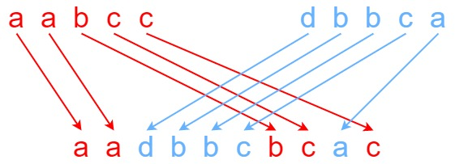

[TOC]


# 52.N 皇后 2

**n 皇后问题** 研究的是如何将 `n` 个皇后放置在 `n × n` 的棋盘上，并且使皇后彼此之间不能相互攻击。

给你一个整数 `n` ，返回 **n 皇后问题** 不同的解决方案的数量。

 

**示例 1：**


```
输入：n = 4
输出：2
解释：如上图所示，4 皇后问题存在两个不同的解法。
```


回溯，将当前的行数和当前的地图状态向下传递

```py
class Solution:
    def totalNQueens(self, n: int) -> int:
        count = 0
        def backtarck(i: int, lis: List[List]):
            nonlocal count
            if i == n:
                count += 1
                return
            for j, boo in enumerate(lis[i]):
                if boo:
                    lis_copy = [row[:] for row in lis]
                    lis_copy[i][:] = [False] * n
                    for k in range(n):
                        lis_copy[k][j] = False
                        if i + k < n and j + k < n:
                            lis_copy[i + k][j + k] = False
                        if i + k < n and j - k >= 0:
                            lis_copy[i + k][j - k] = False
                        if i - k >= 0 and j + k < n:
                            lis_copy[i - k][j + k] = False
                        if i - k >= 0 and j - k >= 0:
                            lis_copy[i - k][j - k] = False
                    backtarck(i + 1, lis_copy)
            return
        lis = [[True] * n for _ in range(n)]
        backtarck(0, lis)
        return count 
```

这段代码实现了 `N` 皇后问题的求解，计算 `n x n` 棋盘上可以摆放 `n` 个不互相攻击的皇后的所有方案数。主要使用了回溯算法。具体思路如下：

1. **定义计数变量**：使用 `count` 记录符合条件的摆放方案数。

2. **定义回溯函数 `backtrack(i, lis)`**：
   - 参数 `i` 表示当前正在摆放皇后的行号。
   - `lis` 是一个二维列表，表示棋盘上的每个位置是否可放置皇后。

3. **回溯终止条件**：
   - 当 `i == n` 时，说明已经成功摆放了 `n` 个皇后，即找到一个有效解，将 `count` 增加 1，并返回。

4. **遍历列选择**：
   - 对当前行 `i` 中的每个列 `j`，如果当前位置 `lis[i][j]` 可放置皇后（即为 `True`），则：
     - **复制棋盘状态**：生成棋盘的副本 `lis_copy`，因为每次尝试一个新位置都需要更新棋盘。
     - **更新不可放置区域**：将当前位置的行、列及对角线的所有位置标记为 `False`，以表示这些位置已被攻击，不能放置皇后。
     - **递归调用**：递归调用 `backtrack(i + 1, lis_copy)`，继续尝试下一行的皇后摆放。

5. **初始化棋盘并开始回溯**：
   - 创建一个 `n x n` 的棋盘，初始化为 `True` 表示所有位置均可用。
   - 调用 `backtrack(0, lis)` 从第 0 行开始尝试。

6. **返回结果**：最终返回 `count`，即符合条件的摆放方案总数。

这种方法通过回溯逐行摆放皇后，并在每一步动态更新不可放置区域，确保每个方案都是有效的。

---

# 53.最大子数组和

给你一个整数数组 `nums` ，请你找出一个具有最大和的连续子数组（子数组最少包含一个元素），返回其最大和。

**子数组** 是数组中的一个连续部分。

 

**示例 1：**

```
输入：nums = [-2,1,-3,4,-1,2,1,-5,4]
输出：6
解释：连续子数组 [4,-1,2,1] 的和最大，为 6 。
```

暴力（超时了）
```py
class Solution:
    def maxSubArray(self, nums: List[int]) -> int:
        lis = [[0] * len(nums) for _ in range(len(nums))]
        for i in range(len(nums)):
            lis[i][i] = nums[i]
        for k in range(2, len(nums)+1):
            for i in range(len(nums)-k + 1):
                lis[i][i+k-1] = max(lis[i][i+k-2], lis[i+1][i+k-1], sum(nums[i:i+k]))
        return lis[0][-1]
```


**动态规划**

 ```py
 class Solution:
     def maxSubArray(self, nums: List[int]) -> int:
         pre = 0
         max_sum = nums[0]
         for num in nums:
             pre = max(pre + num, num)
             max_sum = max(max_sum, pre)
         return max_sum
 ```

这段代码实现了求解数组 `nums` 中最大子数组和的问题，使用了动态规划的思想，具体步骤如下：

1. **初始化**：
   - `pre` 表示当前子数组的和，初始为 0。
   - `max_sum` 用于记录当前最大子数组和，初始为 `nums[0]`（即数组的第一个元素）。
2. **遍历数组**：
   - 对于每个元素 `num`，计算包含当前元素的最大子数组和：
     - 更新 `pre = max(pre + num, num)`，表示要么将当前元素 `num` 加入到之前的子数组和中，要么重新开始一个新的子数组（如果当前元素自身比累加的和更大）。
   - 更新 `max_sum = max(max_sum, pre)`，以记录迄今为止遇到的最大子数组和。
3. **返回结果**：最终 `max_sum` 即为所求的最大子数组和。

这种方法通过一次遍历数组，在 `O(n)` 的时间内找到最大子数组和。


---

# 61.旋转链表

给你一个链表的头节点 `head` ，旋转链表，将链表每个节点向右移动 `k` 个位置。

 

**示例 1：**


```
输入：head = [1,2,3,4,5], k = 2
输出：[4,5,1,2,3]
```

```py
class Solution:
    def rotateRight(self, head: Optional[ListNode], k: int) -> Optional[ListNode]:
        length = 0
        p = head
        if p == None:
            return head
        while p.next != None:
            length += 1
            p = p.next
        length += 1
        p.next = head
        p = head
        k = k % length
        for _ in range(length - k - 1):
            p = p.next
        head = p.next
        p.next = None
        return head
```

这段代码实现了将链表向右旋转 `k` 位的功能。具体思路如下：

1. **计算链表长度**：
   - 初始化指针 `p` 指向链表的头节点 `head`，并遍历链表，计算链表的长度 `length`。
   - 遍历结束后，`p` 指向链表的最后一个节点，将其 `next` 指向 `head`，使链表形成一个环。
2. **计算实际旋转步数**：
   - 因为旋转 `k` 位和旋转 `k % length` 位效果相同，故将 `k` 更新为 `k % length`。
3. **找到新的链表尾节点**：
   - 重新将指针 `p` 指向 `head`，然后移动 `length - k - 1` 次，使 `p` 指向新的尾节点。
   - 新的头节点将是 `p.next`。
4. **断开环**：
   - 将 `p.next` 设置为 `None`，断开环，形成一个新的链表。
5. **返回结果**：
   - 最终返回新的头节点 `head`。

这种方法将链表首尾连接成环，再通过计算找到新的头尾节点，实现链表的旋转，时间复杂度为 `O(n)`。

---

# 63.不同路径

给定一个 `m x n` 的整数数组 `grid`。一个机器人初始位于 **左上角**（即 `grid[0][0]`）。机器人尝试移动到 **右下角**（即 `grid[m - 1][n - 1]`）。机器人每次只能向下或者向右移动一步。

网格中的障碍物和空位置分别用 `1` 和 `0` 来表示。机器人的移动路径中不能包含 **任何** 有障碍物的方格。

返回机器人能够到达右下角的不同路径数量。

测试用例保证答案小于等于 `2 * 109`。

 

**示例 1：**


```
输入：obstacleGrid = [[0,0,0],[0,1,0],[0,0,0]]
输出：2
解释：3x3 网格的正中间有一个障碍物。
从左上角到右下角一共有 2 条不同的路径：
1. 向右 -> 向右 -> 向下 -> 向下
2. 向下 -> 向下 -> 向右 -> 向右
```

 **动态规划**

```py
class Solution:
    def uniquePathsWithObstacles(self, obstacleGrid: List[List[int]]) -> int:
        m, n = len(obstacleGrid), len(obstacleGrid[0])
        dp = [[0] * n for _ in range(m)]
        dp[0][0] = 1 if obstacleGrid[0][0] == 0 else 0
        for i in range(1, m):
            dp[i][0] = dp[i-1][0] if obstacleGrid[i][0] == 0 else 0
        for j in range(1, n):
            dp[0][j] = dp[0][j-1] if obstacleGrid[0][j] == 0 else 0
        for i in range(1, m):
            for j in range(1, n):
                dp[i][j] = dp[i-1][j] + dp[i][j-1] if obstacleGrid[i][j] == 0 else 0
        return dp[-1][-1]
```

这段代码解决了一个带有障碍物的网格中的路径问题，即在网格 `obstacleGrid` 中，从左上角到右下角有多少条不同的路径，路径只能向右或向下移动。具体思路如下：

1. **初始化网格大小**：
   - `m` 和 `n` 分别为网格的行数和列数。
   - 使用 `dp` 二维数组记录到达每个位置的路径数，其中 `dp[i][j]` 表示到达位置 `(i, j)` 的路径数。

2. **设置起点**：
   - 如果起点 `obstacleGrid[0][0]` 没有障碍物，则 `dp[0][0]` 设为 1，否则设为 0（有障碍物时无法从起点出发）。

3. **初始化第一行和第一列**：
   - 对于第一列，如果当前位置无障碍物，则沿着列方向的路径数和上一个位置相同，否则为 0。
   - 对于第一行，如果当前位置无障碍物，则路径数和左侧相同，否则为 0。

4. **填充动态规划表**：
   - 对于每个位置 `(i, j)`，如果没有障碍物，则路径数为 `dp[i-1][j] + dp[i][j-1]`，即来自上方和左侧的路径数之和。
   - 如果有障碍物，则该位置的路径数设为 0，因为不可达。

5. **返回结果**：
   - 最后，`dp[-1][-1]` 表示到达终点的路径总数。

此算法利用动态规划解决路径问题，考虑障碍物的影响，时间复杂度为 `O(m * n)`。

---

# 64.最小路径和

给定一个包含非负整数的 `*m* x *n*` 网格 `grid` ，请找出一条从左上角到右下角的路径，使得路径上的数字总和为最小。

**说明：**每次只能向下或者向右移动一步。

 

**示例 1：**


```
输入：grid = [[1,3,1],[1,5,1],[4,2,1]]
输出：7
解释：因为路径 1→3→1→1→1 的总和最小。
```

**动态规划**

```py
class Solution:
    def minPathSum(self, grid: List[List[int]]) -> int:
        m, n = len(grid), len(grid[0])
        dp = [[0] * n for _ in range(m)]
        for i in range(m):
            dp[i][0] = dp[i-1][0] + grid[i][0] if i > 0 else grid[i][0]
        for j in range(n):
            dp[0][j] = dp[0][j-1] + grid[0][j] if j > 0 else grid[0][j]
        for i in range(1, m):
            for j in range(1, n):
                dp[i][j] = min(dp[i-1][j], dp[i][j-1]) + grid[i][j]
        return dp[-1][-1]
```

---

# 66.加一

给定一个由 **整数** 组成的 **非空** 数组所表示的非负整数，在该数的基础上加一。

最高位数字存放在数组的首位， 数组中每个元素只存储**单个**数字。

你可以假设除了整数 0 之外，这个整数不会以零开头。

 

**示例 1：**

```
输入：digits = [1,2,3]
输出：[1,2,4]
解释：输入数组表示数字 123。
```

```py
class Solution:
    def plusOne(self, digits: List[int]) -> List[int]:
        r = 1
        for i in range(len(digits)-1, -1, -1):
            if r == 0:
                break
            r = (digits[i] + 1) // 10
            digits[i] = (digits[i] + 1) % 10
        return digits if r == 0 else [1] + digits
```

这段代码实现了对整数列表 `digits` 进行“加一”的操作，其中每个元素代表一个数字，最终返回加一后的结果。具体思路如下：

1. **初始化进位**：`r` 初始设为 1，表示从最低位开始执行“加一”的操作。

2. **从右向左遍历**：
   - 从列表的末尾（最低位）向前遍历每一位数字 `digits[i]`。
   - 如果进位 `r` 为 0，说明无需继续加一，提前结束循环。
   - 否则，更新当前位 `digits[i]`：将 `digits[i] + 1` 的结果取余数 `10`（即 `(digits[i] + 1) % 10`）赋值给 `digits[i]`，计算进位 `r` 为 `(digits[i] + 1) // 10`。
   
3. **处理最高位的进位**：
   - 如果遍历结束后 `r` 仍为 1，说明存在额外的进位，需要在 `digits` 前插入 `1`，例如 `[9, 9, 9]` 变为 `[1, 0, 0, 0]`。

4. **返回结果**：最终返回更新后的 `digits`。

这种方法通过从低位向高位逐位加一，处理了可能存在的进位情况，时间复杂度为 `O(n)`。

---

# 67.二进制求和

给你两个二进制字符串 `a` 和 `b` ，以二进制字符串的形式返回它们的和。

 

**示例 1：**

```
输入:a = "11", b = "1"
输出："100"
```


模拟

```py
class Solution:
    def addBinary(self, a: str, b: str) -> str:
        r = 0
        alis = [int(i) for i in a]
        blis = [int(i) for i in b]
        if len(alis) < len(blis):
            alis, blis = blis, alis
        for i in range(len(alis)-1, -1, -1):
            if i < len(alis) - len(blis):
                r, alis[i] = (alis[i] + r) // 2, (alis[i] + r) % 2
                continue
            r, alis[i] = (alis[i] + blis[i - len(alis) + len(blis)] + r) // 2, (alis[i] + blis[i - len(alis) + len(blis)] + r) % 2
        if r == 1:
            alis = [1] + alis
        return "".join([str(i) for i in alis])
```

# 70.爬楼梯

假设你正在爬楼梯。需要 `n` 阶你才能到达楼顶。

每次你可以爬 `1` 或 `2` 个台阶。你有多少种不同的方法可以爬到楼顶呢？

 

**示例 1：**

```
输入：n = 2
输出：2
解释：有两种方法可以爬到楼顶。
1. 1 阶 + 1 阶
2. 2 阶
```

动态规划

```py
class Solution:
    def climbStairs(self, n: int) -> int:
        dp = [0] * (n+1)
        dp[0], dp[1] = 1, 1
        for i in range(2, n+1):
            dp[i] = dp[i-1] + dp[i-2]
        return dp[-1]
```

# 72.编辑距离

给你两个单词 `word1` 和 `word2`， *请返回将 `word1` 转换成 `word2` 所使用的最少操作数* 。

你可以对一个单词进行如下三种操作：

- 插入一个字符
- 删除一个字符
- 替换一个字符

 

**示例 1：**

```
输入：word1 = "horse", word2 = "ros"
输出：3
解释：
horse -> rorse (将 'h' 替换为 'r')
rorse -> rose (删除 'r')
rose -> ros (删除 'e')
```

动态规划

```py
class Solution:
    def minDistance(self, word1: str, word2: str) -> int:
        m, n = len(word1)+1, len(word2)+1
        dp = [[0] * n for _ in range(m)]
        for i in range(m):
            dp[i][0] = i
        for j in range(n):
            dp[0][j] = j
        for i in range(1, m):
            for j in range(1, n):
                dp[i][j] = min(dp[i-1][j]+1, dp[i][j-1]+1, dp[i-1][j-1] + (0 if word1[i-1] == word2[j-1] else 1))
        return dp[-1][-1]
```

这段代码实现了计算两个字符串 `word1` 和 `word2` 的最小编辑距离（Levenshtein Distance），即将 `word1` 转换成 `word2` 所需的最少操作次数。具体思路如下：

1. **初始化 DP 表格**：
   - 创建一个大小为 `(m x n)` 的二维数组 `dp`，其中 `m` 和 `n` 分别是 `word1` 和 `word2` 的长度加 1。
   - `dp[i][j]` 表示将 `word1` 的前 `i` 个字符转换为 `word2` 的前 `j` 个字符所需的最小操作数。

2. **边界条件**：
   - 第一列 `dp[i][0] = i` 表示将 `word1` 的前 `i` 个字符转换为空字符串所需的操作数，即全部删除操作。
   - 第一行 `dp[0][j] = j` 表示将空字符串转换为 `word2` 的前 `j` 个字符所需的操作数，即全部插入操作。

3. **填充 DP 表格**：
   - 从 `dp[1][1]` 开始逐行填充每个 `dp[i][j]` 的值。
   - 对于每个 `dp[i][j]`，计算三种可能的操作：
     - 删除操作：`dp[i-1][j] + 1`
     - 插入操作：`dp[i][j-1] + 1`
     - 替换操作：`dp[i-1][j-1] + 1`（如果 `word1[i-1] != word2[j-1]`）或 `dp[i-1][j-1]`（如果 `word1[i-1] == word2[j-1]`，即无需替换）
   - 取三者的最小值填入 `dp[i][j]`。

4. **返回结果**：
   - 最终返回 `dp[-1][-1]`，即将 `word1` 转换为 `word2` 所需的最少操作数。

该算法使用动态规划，时间和空间复杂度均为 `O(m * n)`。


---

# 74.搜索二维矩阵

给你一个满足下述两条属性的 `m x n` 整数矩阵：

- 每行中的整数从左到右按非严格递增顺序排列。
- 每行的第一个整数大于前一行的最后一个整数。

给你一个整数 `target` ，如果 `target` 在矩阵中，返回 `true` ；否则，返回 `false` 。

 

**示例 1：**


```
输入：matrix = [[1,3,5,7],[10,11,16,20],[23,30,34,60]], target = 3
输出：true
```

```py
class Solution:
    def searchMatrix(self, matrix: List[List[int]], target: int) -> bool:
        m, n = len(matrix), len(matrix[0])
        length = m * n
        left, right = 0, length - 1
        while left < right:
            mid = (left + right) // 2
            mid_value = matrix[mid // n][mid % n]
            if mid_value == target:
                return True
            elif mid_value < target:
                left = mid + 1
            else:
                right = mid
        return matrix[left // n][left % n] == target
```


这段代码实现了在一个二维矩阵 `matrix` 中查找目标值 `target` 的功能，其中矩阵的每行从左到右递增，每列从上到下递增。代码将矩阵视为一个一维有序数组，使用二分查找来提高查找效率。具体思路如下：

1. **初始化**：
   - 获取矩阵的行数 `m` 和列数 `n`。
   - 将整个矩阵看作一维数组，其长度为 `length = m * n`。
   - 定义左右指针 `left` 和 `right`，分别指向一维数组的起点 `0` 和终点 `length - 1`。

2. **二分查找**：
   - 在 `left < right` 的条件下进行二分查找。
   - 计算中点 `mid`，并利用 `mid` 来获取中点元素 `mid_value`：`matrix[mid // n][mid % n]`。
     - `mid // n` 得到元素所在的行索引，`mid % n` 得到列索引。
   - 检查 `mid_value` 是否等于目标值 `target`：
     - 如果相等，返回 `True`。
     - 如果 `mid_value < target`，说明目标值在右半部分，将 `left` 移动到 `mid + 1`。
     - 如果 `mid_value > target`，说明目标值在左半部分，将 `right` 移动到 `mid`。

3. **返回结果**：
   - 二分查找结束后，`left` 指向最终的搜索位置。
   - 检查 `matrix[left // n][left % n]` 是否等于 `target`，相等则返回 `True`，否则返回 `False`。

该方法通过二分查找实现了 `O(log(m * n))` 的查找效率。

---

# 77.组合

给定两个整数 `n` 和 `k`，返回范围 `[1, n]` 中所有可能的 `k` 个数的组合。

你可以按 **任何顺序** 返回答案。

 

**示例 1：**

```
输入：n = 4, k = 2
输出：
[
  [2,4],
  [3,4],
  [2,3],
  [1,2],
  [1,3],
  [1,4],
]
```

回溯

```py
class Solution:
    def combine(self, n: int, k: int) -> List[List[int]]:
        res = []
        def backtrack(path):
            if len(path) == k:
                res.append(path[:])
                return
            for i in range(path[-1]+1 if path else 1, n+1):
                path.append(i)
                backtrack(path)
                path.pop()
        backtrack([])
        return res
```


这段代码使用回溯算法生成从 `1` 到 `n` 的所有 `k` 个数的组合。具体思路如下：

1. **初始化结果列表**：`res` 用于存储所有符合条件的组合。

2. **定义回溯函数 `backtrack(path)`**：
   - 参数 `path` 是当前正在构建的组合。
   - 当 `path` 的长度等于 `k` 时，说明已经找到一个满足条件的组合，将其复制添加到 `res` 中，然后返回。

3. **递归构建组合**：
   - 在当前组合 `path` 的基础上，从 `path` 的最后一个元素的下一个数字开始（如果 `path` 为空，则从 `1` 开始），逐个尝试将剩余数字加入到组合中。
   - 将 `i` 加入 `path` 后，递归调用 `backtrack(path)` 继续构建下一个数字。
   - 递归调用完成后，将 `i` 从 `path` 中移除（即回溯操作），尝试下一个数字。

4. **返回结果**：最终返回 `res`，其中包含所有从 `1` 到 `n` 的 `k` 个数的组合。

这种方法通过回溯和递归构建每个组合，确保生成所有可能的组合。时间复杂度约为 `O(C(n, k))`，即组合的总数。

---

# 79.单词搜索

给定一个 `m x n` 二维字符网格 `board` 和一个字符串单词 `word` 。如果 `word` 存在于网格中，返回 `true` ；否则，返回 `false` 。

单词必须按照字母顺序，通过相邻的单元格内的字母构成，其中“相邻”单元格是那些水平相邻或垂直相邻的单元格。同一个单元格内的字母不允许被重复使用。

 

**示例 1：**


```
输入：board = [["A","B","C","E"],["S","F","C","S"],["A","D","E","E"]], word = "ABCCED"
输出：true
```

深搜

```py
class Solution:
    def exist(self, board: List[List[str]], word: str) -> bool:
        def dfs(path, i, j):
            if len(path) == len(word):
                return True
            if i < 0 or i >= len(board) or j < 0 or j >= len(board[0]):
                return False
            if (i, j) in path:
                return False
            if board[i][j] != word[len(path)]:
                return False
            path.append((i, j))
            if dfs(path, i-1, j) or dfs(path, i+1, j) or dfs(path, i, j-1) or dfs(path, i, j+1):
                return True
            path.pop()
            return False
        for i in range(len(board)):
            for j in range(len(board[0])):
                if dfs([], i, j):
                    return True
        return False
```

这段代码用于在二维字符网格 `board` 中查找是否存在路径可以拼出给定字符串 `word`，使用了深度优先搜索（DFS）来实现。具体思路如下：

1. **定义 DFS 递归函数 `dfs(path, i, j)`**：
   - `path` 记录当前访问过的路径节点，用于避免重复访问。
   - `i` 和 `j` 是当前网格的位置索引。
   
2. **终止条件**：
   - 如果 `path` 的长度等于 `word` 的长度，说明已经找到完整的路径，返回 `True`。
   - 如果 `i` 或 `j` 越界，返回 `False`。
   - 如果当前位置 `(i, j)` 已在路径中或当前字符不匹配 `word` 中对应位置的字符，返回 `False`。
   
3. **递归搜索**：
   - 将当前节点 `(i, j)` 加入 `path`，然后递归地检查上下左右四个方向是否可以继续拼出单词。
   - 如果任一方向的递归调用返回 `True`，则返回 `True`。
   - 如果四个方向均不符合条件，弹出当前节点 `(i, j)`，回溯到上一步。

4. **开始搜索**：
   - 遍历网格的每个位置 `(i, j)` 作为起点，调用 `dfs([], i, j)`。
   - 如果某次调用返回 `True`，则立即返回 `True`，表示已找到该单词路径。

5. **返回结果**：
   - 如果遍历完所有位置都未找到符合条件的路径，返回 `False`。

这种方法通过 DFS 和回溯避免重复访问，确保了完整的路径匹配。时间复杂度在最坏情况下为 `O(m * n * 4^L)`，其中 `m` 和 `n` 是网格的维度，`L` 是单词的长度。


---

# 82.删除排序链表中的重复元素 2

给定一个已排序的链表的头 `head` ， *删除原始链表中所有重复数字的节点，只留下不同的数字* 。返回 *已排序的链表* 。

 

**示例 1：**


```
输入：head = [1,2,3,3,4,4,5]
输出：[1,2,5]
```

虚节点+模拟

```py
class Solution:
    def deleteDuplicates(self, head: Optional[ListNode]) -> Optional[ListNode]:
        nhead = ListNode(float('-inf'), head)
        p = nhead
        while p:
            if p.next and p.next.next and p.next.val == p.next.next.val:
                q = p.next.next
                while q and q.val == p.next.val:
                    q=q.next
                p.next = q
                continue
            p = p.next
        return nhead.next
```


---

# 86.分隔链表

给你一个链表的头节点 `head` 和一个特定值 `x` ，请你对链表进行分隔，使得所有 **小于** `x` 的节点都出现在 **大于或等于** `x` 的节点之前。

你应当 **保留** 两个分区中每个节点的初始相对位置。

 

**示例 1：**


```
输入：head = [1,4,3,2,5,2], x = 3
输出：[1,2,2,4,3,5]
```

```py
class Solution:
    def partition(self, head: Optional[ListNode], x: int) -> Optional[ListNode]:
        p1 = head1 = None
        p2 = head2 = None
        p = head
        while p:
            if p.val < x:
                if not head1:
                    head1 = ListNode(p.val)
                    p1 = head1
                else:
                    p1.next = ListNode(p.val)
                    p1 = p1.next
            else:
                if not head2:
                    head2 = ListNode(p.val)
                    p2 = head2
                else:
                    p2.next = ListNode(p.val)
                    p2 = p2.next
            p = p.next
        if p1:
            p1.next = head2
        return head1 if head1 else head2
```

这段代码将链表按值 `x` 分为两部分：小于 `x` 的节点放在前，大于等于 `x` 的节点放在后。具体步骤如下：

1. **初始化两部分链表**：
   - `head1` 和 `head2` 分别是小于 `x` 和大于等于 `x` 的链表头。
   - `p1` 和 `p2` 分别是两部分链表的当前尾节点指针。

2. **遍历链表**：
   - 若 `p.val < x`，将节点添加到 `p1` 的链表，否则添加到 `p2` 的链表。

3. **合并**：
   - 将 `p1.next` 指向 `head2`，并返回 `head1`。

这种方法保持节点相对顺序，时间复杂度为 `O(n)`。

---

# 97.交错字符串

给定三个字符串 `s1`、`s2`、`s3`，请你帮忙验证 `s3` 是否是由 `s1` 和 `s2` **交错** 组成的。

两个字符串 `s` 和 `t` **交错** 的定义与过程如下，其中每个字符串都会被分割成若干 **非空** 子字符串：

- `s = s1 + s2 + ... + sn`
- `t = t1 + t2 + ... + tm`
- `|n - m| <= 1`
- **交错** 是 `s1 + t1 + s2 + t2 + s3 + t3 + ...` 或者 `t1 + s1 + t2 + s2 + t3 + s3 + ...`

**注意：**`a + b` 意味着字符串 `a` 和 `b` 连接。

 

**示例 1：**



```
输入：s1 = "aabcc", s2 = "dbbca", s3 = "aadbbcbcac"
输出：true
```

动态规划

```py
class Solution:
    def isInterleave(self, s1: str, s2: str, s3: str) -> bool:
        m, n = len(s1) + 1, len(s2) + 1
        if m + n != len(s3) + 2:
            return False
        dp = [[False] * n for _ in range(m)]
        dp[0][0] = True
        for i in range(1, m):
            dp[i][0] = dp[i-1][0] and s1[i-1] == s3[i-1]
        for j in range(1, n):
            dp[0][j] = dp[0][j-1] and s2[j-1] == s3[j-1]
        for i in range(1, m):
            for j in range(1, n):
                dp[i][j] = (dp[i-1][j] and s1[i-1] == s3[i+j-1]) or (dp[i][j-1] and s2[j-1] == s3[i+j-1])
        return dp[-1][-1]
```

该代码的逻辑简洁概述如下：

1. **输入检查**：首先检查 `s3` 的长度是否等于 `s1` 和 `s2` 长度之和，不等则直接返回 `False`。

2. **动态规划初始化**：使用二维布尔数组 `dp`，其中 `dp[i][j]` 表示 `s1` 的前 `i` 个字符和 `s2` 的前 `j` 个字符能否组成 `s3` 的前 `i+j` 个字符。
   - 初始状态：`dp[0][0] = True`，即空字符串可以组成空字符串。
   - 边界条件：用 `s1` 和 `s2` 填充 `dp` 的第一行和第一列。

3. **填充 DP 表**：
   - 对于 `dp[i][j]`，检查从 `s1` 和 `s2` 中分别取一个字符能否匹配 `s3` 中的当前字符，如果可以匹配则标记为 `True`。

4. **返回结果**：`dp[m-1][n-1]` 表示 `s1` 和 `s2` 是否能交错组成 `s3`。

---

# 98.验证二叉搜索树

**有效** 二叉搜索树定义如下：

- 节点的左子树只包含 **小于** 当前节点的数。
- 节点的右子树只包含 **大于** 当前节点的数。
- 所有左子树和右子树自身必须也是二叉搜索树。

 

**示例 1：**


```
输入：root = [2,1,3]
输出：true
```

```py
class Solution:
    def isValidBST(self, root: Optional[TreeNode]) -> bool:
        result = True
        def visit(node, lower=float('-inf'), upper=float('inf')):
            nonlocal result
            if not result:
                return
            if not (lower < node.val < upper):
                result = False
                return
            if node.left:
                visit(node.left, lower, node.val)
            if node.right:
                visit(node.right, node.val, upper)
        if root:
            visit(root)
        return result
```

该代码的逻辑简述如下：

1. **初始化**：定义一个变量 `result`，用于跟踪整个树是否满足二叉搜索树 (BST) 的性质。

2. **递归函数 `visit`**：定义了一个递归函数 `visit` 来检查每个节点是否符合 BST 要求：
   - 每个节点的值应在允许的范围 `lower` 和 `upper` 之间。
   - 如果节点值不在该范围内，将 `result` 设置为 `False`，停止进一步检查。
   - 递归检查左右子树，将左子树的上界设为当前节点值，将右子树的下界设为当前节点值。

3. **开始验证**：从根节点开始调用 `visit`，递归检查整个树。

4. **返回结果**：最终返回 `result` 表示该树是否为有效的 BST。

---

# 123.买卖股票的最佳时机 3

给定一个数组，它的第 `i` 个元素是一支给定的股票在第 `i` 天的价格。

设计一个算法来计算你所能获取的最大利润。你最多可以完成 **两笔** 交易。

**注意：**你不能同时参与多笔交易（你必须在再次购买前出售掉之前的股票）。

 

**示例 1:**

```
输入：prices = [3,3,5,0,0,3,1,4]
输出：6
解释：在第 4 天（股票价格 = 0）的时候买入，在第 6 天（股票价格 = 3）的时候卖出，这笔交易所能获得利润 = 3-0 = 3 。
     随后，在第 7 天（股票价格 = 1）的时候买入，在第 8 天 （股票价格 = 4）的时候卖出，这笔交易所能获得利润 = 4-1 = 3 。
```

```py
class Solution:
    def maxProfit(self, prices: List[int]) -> int:
        hold = [float('-inf')] * 3
        not_hold = [0] * 3
        for price in prices:
            for j in range(1, 3):
                not_hold[j] = max(not_hold[j], hold[j] + price)
                hold[j] = max(hold[j], not_hold[j-1] - price)
        return not_hold[2]
```

这段代码实现了一个在最多进行两次交易的条件下，计算最大利润的算法。其逻辑如下：

1. **初始化状态变量**：
   - `hold[i]`表示第`i`次买入股票的最大收益，初始值为负无穷。
   - `not_hold[i]`表示第`i`次卖出股票后的最大收益，初始值为0。

2. **遍历价格数组**：
   - 对于每一个`price`，更新持有和不持有股票时的最大收益。
   - 内层循环中，`not_hold[j]`是第`j`次卖出后的最大收益；`hold[j]`是第`j`次买入后的最大收益。

3. **返回结果**：
   - `not_hold[2]`表示最多两次交易后的最大收益。

简而言之，这段代码使用动态规划来更新持有和不持有股票的收益状态，从而得到最大利润。

---

# 124.二叉树中的最大路径和

二叉树中的 **路径** 被定义为一条节点序列，序列中每对相邻节点之间都存在一条边。同一个节点在一条路径序列中 **至多出现一次** 。该路径 **至少包含一个** 节点，且不一定经过根节点。

**路径和** 是路径中各节点值的总和。

给你一个二叉树的根节点 `root` ，返回其 **最大路径和** 。

 

**示例 1：**


```
输入：root = [1,2,3]
输出：6
解释：最优路径是 2 -> 1 -> 3 ，路径和为 2 + 1 + 3 = 6
```

```py
class Solution:
    def maxPathSum(self, root: Optional[TreeNode]) -> int:
        maxSum = float('-inf')
        def dfs(node: Optional[TreeNode]):
            nonlocal maxSum
            if not node:
                return (0, 0)
            maxLeft = max(max(dfs(node.left)), 0)
            maxRight = max(max(dfs(node.right)), 0)
            maxSum = max(maxSum, node.val + maxLeft + maxRight)
            return (maxLeft + node.val, maxRight + node.val)
        dfs(root)
        return maxSum
```

该代码旨在计算二叉树中任意路径的最大路径和。逻辑简述如下：

1. **初始化最大路径和**：定义 `maxSum`，初始值为负无穷，用于记录遍历过程中发现的最大路径和。

2. **递归函数 `dfs`**：
   - `dfs(node)` 返回从当前节点 `node` 出发的左右路径最大贡献值。
   - 如果 `node` 为 `None`，返回 `(0, 0)` 表示空节点贡献值为0。
   - 递归计算左右子树的最大路径和 `maxLeft` 和 `maxRight`，如果某一子路径贡献值为负则取0（不选该路径）。

3. **更新 `maxSum`**：
   - 对于每个节点，计算包含左右子树路径的最大路径和 `node.val + maxLeft + maxRight`，并更新 `maxSum`。

4. **返回路径贡献值**：
   - 对于每个节点 `node`，返回左右路径中较大的一个加上当前节点值，以供父节点选择。

5. **最终结果**：递归遍历完成后，`maxSum` 即为全局最大路径和。

代码中存在冗余部分，`dfs` 实际只需返回单个路径贡献值而不是 `(maxLeft + node.val, maxRight + node.val)`，以下为简化代码：

```python
class Solution:
    def maxPathSum(self, root: Optional[TreeNode]) -> int:
        maxSum = float('-inf')
        def dfs(node: Optional[TreeNode]) -> int:
            nonlocal maxSum
            if not node:
                return 0
            maxLeft = max(dfs(node.left), 0)
            maxRight = max(dfs(node.right), 0)
            maxSum = max(maxSum, node.val + maxLeft + maxRight)
            return node.val + max(maxLeft, maxRight)
        dfs(root)
        return maxSum
```

### 解释
- 每次递归返回单路径贡献值 `node.val + max(maxLeft, maxRight)`，即从 `node` 到某一子节点的最大贡献路径。

---

